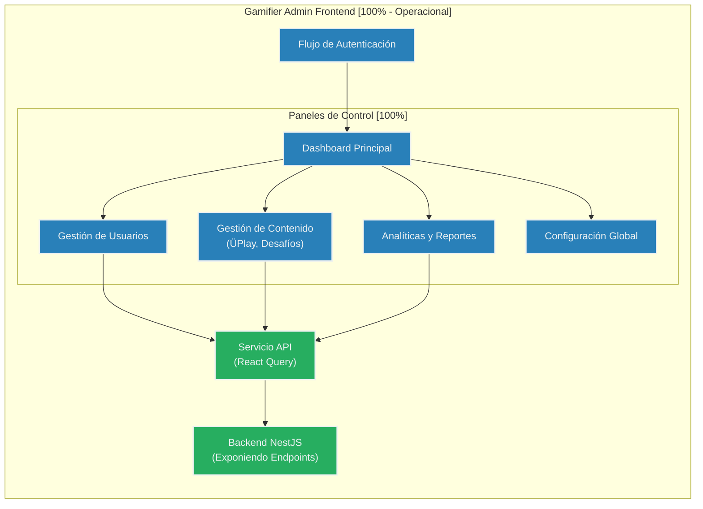

```mermaid
graph TD;
    classDef done fill:#2980b9,stroke:#ecf0f1,stroke-width:2px,color:#ecf0f1;
    classDef api fill:#27ae60,stroke:#ecf0f1,stroke-width:2px,color:#ecf0f1;

    subgraph "Gamifier Admin Frontend [100% - Operacional]";
        direction TB;

        AdminLogin["Flujo de Autenticación"]:::done;
        
        subgraph "Paneles de Control [100%]";
            Dashboard["Dashboard Principal"]:::done;
            UserManagement["Gestión de Usuarios"]:::done;
            ContentCreation["Gestión de Contenido<br/>(ÜPlay, Desafíos)"]:::done;
            Analytics["Analíticas y Reportes"]:::done;
            Settings["Configuración Global"]:::done;
        end
        
        APIService["Servicio API<br/>(React Query)"]:::api;
        Backend["Backend NestJS<br/>(Exponiendo Endpoints)"]:::api;
        
        AdminLogin --> Dashboard;
        Dashboard --> UserManagement;
        Dashboard --> ContentCreation;
        Dashboard --> Analytics;
        Dashboard --> Settings;

        UserManagement --> APIService;
        ContentCreation --> APIService;
        Analytics --> APIService;
        
        APIService --> Backend;
    end
``` 
