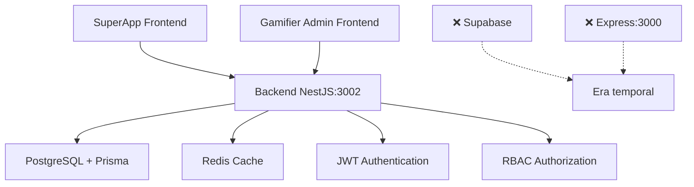

# 📋 Arquitectura del Proyecto CoomÜnity Global - Arquitectura FINAL y DEFINITIVA

## 🎯 **ARQUITECTURA FINAL Y DEFINITIVA CONFIRMADA**

**✅ CLARIFICACIÓN IMPORTANTE:** Este documento refleja la **arquitectura real y definitiva** del proyecto CoomÜnity Global, donde el Backend NestJS compartido es el único backend real para ambos frontends.

## 🏗️ **Arquitectura FINAL y DEFINITIVA del Proyecto**

### 📂 **Estructura del Monorepo REAL**

```
CoomÜnity-Global-Project/
├── backend/                    # 🎯 BACKEND NESTJS COMPARTIDO (Puerto 3002)
├── admin-frontend/             # Frontend Gamifier Admin
├── superapp-frontend/          # 🎯 FRONTEND SUPERAPP (este workspace)
└── shared/                     # Tipos y utilities compartidos
```

### 🚀 **SuperApp Frontend: `apps/superapp-unified/`**

**Esta es la SuperApp CoomÜnity PWA desarrollada independientemente y lista para integración.**

#### **Stack Tecnológico FINAL y DEFINITIVO:**

```json
{
  "frontend": {
    "framework": "React 18 + TypeScript",
    "build": "Vite",
    "ui": "Material-UI v7 + Tailwind CSS",
    "state": "Zustand + React Query",
    "routing": "React Router v6",
    "forms": "React Hook Form + Zod",
    "notifications": "Sonner",
    "testing": "Vitest + Playwright"
  },
  "backend_integration": {
    "primary": "Backend NestJS Compartido (Puerto 3002)",
    "authentication": "JWT del Backend NestJS",
    "database": "PostgreSQL via Prisma (Backend NestJS)"
  }
}
```

#### **Dependencias Actuales (a migrar):**

```javascript
// MANTENER (para la SuperApp)
"@mui/material": "^7.0.1"
"@tanstack/react-query": "^5.76.0"
"tailwindcss": "^3.4.17"
"zustand": "^4.5.2"
"react-router-dom": "^6.22.2"

// REMOVER (eran temporales para desarrollo independiente)
"@supabase/supabase-js": "^2.49.4"  // ❌ Era temporal
```

### 🔧 **Backend: NestJS Compartido (Puerto 3002)**

**Este es el backend REAL y DEFINITIVO ya implementado fuera de este workspace.**

```typescript
// Backend NestJS (fuera de este workspace)
class BackendNestJSServer {
  constructor() {
    this.port = 3002;  // Puerto REAL
  }
}
```

**Características del Backend REAL:**
- **Framework**: NestJS con TypeScript
- **Puerto**: 3002 (DEFINITIVO)
- **Base de Datos**: PostgreSQL con Prisma ORM
- **Autenticación**: JWT con RBAC
- **Cache**: Redis para performance
- **Monitoreo**: Prometheus + Grafana + Winston

### 🌐 **Servicios de Integración REALES**

#### **1. Backend NestJS (Servicio PRINCIPAL Y ÚNICO)**

```typescript
// apps/superapp-unified/src/lib/api-service.ts (A MIGRAR)
const API_BASE_URL = 'http://localhost:3002';  // Backend NestJS REAL

class ApiService {
  // Se conectará al backend NestJS compartido
  async get<T>(endpoint: string): Promise<T> {
    return this.request<T>(endpoint, { 
      method: 'GET',
      headers: {
        'Authorization': `Bearer ${this.getJWTToken()}`,
        'Content-Type': 'application/json'
      }
    });
  }
}
```

#### **2. Migración de Servicios Temporales**

```typescript
// ANTES (temporal - A ELIMINAR):
// apps/superapp-unified/src/lib/backend-integration.ts
export const supabase = createClient(...);  // ❌ Era temporal

// DESPUÉS (real - A IMPLEMENTAR):
// apps/superapp-unified/src/lib/nestjs-integration.ts
export class NestJSApiService {
  async signIn(email: string, password: string) {
    const response = await fetch('http://localhost:3002/auth/login', {
      method: 'POST',
      headers: { 'Content-Type': 'application/json' },
      body: JSON.stringify({ email, password })
    });
    return response.json();
  }
}
```

### 🔄 **Flujo de Datos REAL y DEFINITIVO**



## 🎯 **Módulos Principales de la SuperApp**

### **1. ÜPlay (Gamified Play List)**
- **Propósito**: Módulo principal de consumo de video gamificado
- **Uso**: Regular, diario
- **Integración**: Backend NestJS endpoints `/api/videos`, `/api/playlists`

### **2. Pilgrim Journey**
- **Propósito**: Experiencia de onboarding one-time
- **Uso**: Solo para nuevos usuarios
- **Integración**: Backend NestJS endpoints `/api/onboarding`, `/api/journey`

### **3. Marketplace**
- **Propósito**: Comercio y transacciones
- **Integración**: Backend NestJS endpoints `/api/marketplace`, `/api/transactions`

### **4. Social**
- **Propósito**: Red social y comunicación
- **Integración**: Backend NestJS endpoints `/api/social`, `/api/matches`

### **5. Wallet**
- **Propósito**: Billetera digital
- **Integración**: Backend NestJS endpoints `/api/wallet`, `/api/tokens`

## 🔍 **Estado de Integración por Servicio**

| Servicio | Estado | Tecnología | Puerto/URL |
|----------|--------|------------|------------|
| **SuperApp Frontend** | ✅ 95% Completado | React+TS+Vite | 5173 (dev) |
| **Backend NestJS** | ✅ 100% Funcional | NestJS+Prisma | 3002 |
| **Gamifier Admin** | ✅ 100% Integrado | React+TS | Ya conectado al NestJS |
| **PostgreSQL** | ✅ Funcional | PostgreSQL+Prisma | Vía Backend NestJS |
| **Supabase** | ❌ TEMPORAL | Era para desarrollo | Se eliminará |
| **Express Backend** | ❌ TEMPORAL | Era para desarrollo | Se eliminará |

## 🚨 **Plan de Migración de Temporales a Real**

### **1. Servicios a Migrar (URGENTE)**

**DE (temporal):**
```typescript
// Supabase temporal
const { data, error } = await supabase.auth.signInWithPassword({
  email, password,
});
```

**A (real):**
```typescript
// Backend NestJS real
const response = await fetch('http://localhost:3002/auth/login', {
  method: 'POST',
  headers: { 'Content-Type': 'application/json' },
  body: JSON.stringify({ email, password })
});
```

### **2. Variables de Entorno a Actualizar**

**ANTES (temporal):**
```bash
VITE_SUPABASE_URL=...          # ❌ Eliminar
VITE_SUPABASE_ANON_KEY=...     # ❌ Eliminar
VITE_API_BASE_URL=http://localhost:3000  # ❌ Era Express temporal
```

**DESPUÉS (real):**
```bash
VITE_API_BASE_URL=http://localhost:3002  # ✅ Backend NestJS real
VITE_JWT_SECRET_KEY=...                  # ✅ Del Backend NestJS
```

### **3. Dependencias a Limpiar**

```json
{
  "dependencies": {
    // ❌ ELIMINAR (eran temporales)
    "@supabase/supabase-js": "^2.49.4",
    
    // ✅ MANTENER (para SuperApp)
    "@mui/material": "^7.0.1",
    "@tanstack/react-query": "^5.76.0",
    "tailwindcss": "^3.4.17"
  }
}
```

## 🎯 **Arquitectura Filosófica CoomÜnity**

### **Principios Aplicados:**

- **Ayni (Reciprocidad)**: Sistema de méritos vía Backend NestJS
- **Bien Común**: Marketplace colaborativo vía Backend NestJS
- **Vocación**: Gamificación orientada al crecimiento personal
- **Elementos Naturales**:
  - **Tierra**: Seguridad (JWT + RBAC del Backend NestJS)
  - **Agua**: Fluidez (React Router + smooth UX)
  - **Fuego**: Acción (Gamificación vía Backend NestJS)
  - **Aire**: Visión (Arquitectura NestJS limpia y escalable)

## 🛠️ **Guía de Integración Actualizada**

### **Comandos de Desarrollo REALES:**

```bash
# SuperApp (Desarrollo Actual)
cd apps/superapp-unified/
npm run dev          # Puerto 5173

# Backend NestJS (fuera de este workspace)
# Ya corriendo en puerto 3002

# Tests E2E (después de integración)
npm run test:ux      # Tests contra Backend NestJS:3002
```

### **Variables de Entorno FINALES:**

```bash
# apps/superapp-unified/.env
VITE_API_BASE_URL=http://localhost:3002
VITE_ENABLE_MOCK_AUTH=false
VITE_JWT_SECRET_KEY=your-nestjs-jwt-secret

# ❌ NO CONFIGURAR: Variables de Supabase, Express
```

## 🔄 **Plan de Migración DEFINITIVO**

### **Fase 1: Configuración (INMEDIATO)**
1. ✅ Actualizar variables de entorno para puerto 3002
2. ✅ Configurar CORS en Backend NestJS para SuperApp
3. ✅ Crear servicio de integración NestJS

### **Fase 2: Migración de Servicios (1-2 semanas)**
1. 🔄 Migrar autenticación de Supabase temporal a JWT NestJS
2. 🔄 Migrar datos de usuario de mocks a endpoints NestJS
3. 🔄 Migrar gamificación de mocks a sistema NestJS
4. 🔄 Migrar wallet de mocks a sistema NestJS

### **Fase 3: Limpieza (Final)**
1. 🔄 Eliminar dependencias de Supabase temporal
2. 🔄 Eliminar referencias a Express temporal
3. 🔄 Actualizar todos los tests para Backend NestJS
4. 🔄 Documentación final integrada

## 📊 **Métricas de Migración**

| Aspecto | Estado Temporal | Estado Objetivo |
|---------|-----------------|-----------------|
| Autenticación | Supabase Mock | JWT NestJS |
| Base de Datos | Supabase Mock | PostgreSQL+Prisma |
| API Endpoints | Express Mock | NestJS REST API |
| Estado Global | Zustand | Zustand + NestJS |
| Testing | Mocks | Backend NestJS Real |

---

## 🎯 **Conclusión: Arquitectura FINAL y DEFINITIVA**

**El proyecto CoomÜnity tiene una arquitectura clara y potente:**

1. **Backend NestJS compartido** (ya implementado y funcional)
2. **Gamifier Admin** (ya integrado con backend NestJS)
3. **SuperApp** (desarrollada independientemente, lista para integración)

**Los servicios Supabase y Express eran temporales** para permitir desarrollo independiente sin confusiones. Ahora es momento de integrar la SuperApp con el backend NestJS real.

**Próximo paso:** Ejecutar el plan de migración para conectar la SuperApp con su backend definitivo y eliminar los servicios temporales. 