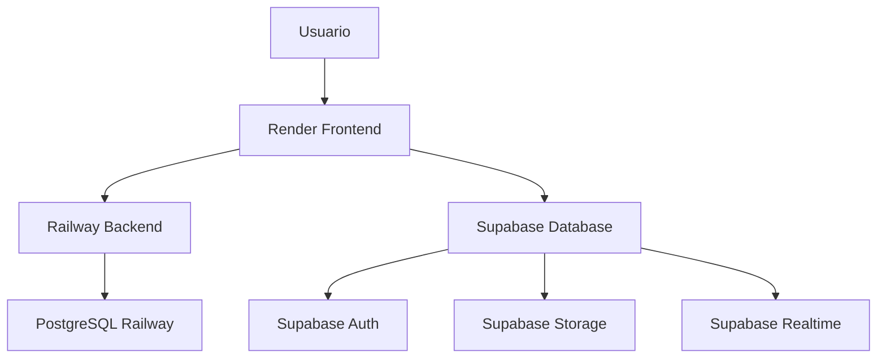

# 🚀 Guía de Deployment - CoomÜnity SuperApp

Esta guía te ayudará a desplegar la SuperApp CoomÜnity usando **Supabase** y **Render** como plataformas principales.

## 📋 Resumen de Integración

### ✅ Estado Actual
- **Vercel**: ✅ Funcionando (https://superapp-unified-o8zxw9nzj-kvn3tojs-projects-9cd69e29.vercel.app)
- **Railway Backend**: ✅ Funcionando (https://backend-production-80bb.up.railway.app)
- **Supabase Integration**: ✅ Configurado (pendiente de credenciales)
- **Render Ready**: ✅ Configuración completa

## 🗄️ Configuración de Supabase

### 1. Crear Proyecto en Supabase

1. Ve a [supabase.com](https://supabase.com)
2. Crea una nueva cuenta o inicia sesión
3. Crea un nuevo proyecto
4. Selecciona región cercana (ej. US East)
5. Crea una contraseña segura para la base de datos

### 2. Obtener Credenciales

En tu proyecto de Supabase:

1. Ve a **Settings** > **API**
2. Copia la **Project URL**
3. Copia la **anon public key**

### 3. Configurar Variables de Entorno

Agrega estas variables a tu archivo `.env`:

```bash
# Supabase Configuration
VITE_SUPABASE_URL=https://tu-proyecto.supabase.co
VITE_SUPABASE_ANON_KEY=tu_clave_anonima_aqui
```

### 4. Probar Integración

1. Reinicia el servidor: `npm run dev`
2. Ve a: http://localhost:3001/supabase-test
3. Verifica que aparezca "Configured" en el estado

## 🚀 Deployment en Render

### 1. Preparación

**Archivos incluidos:**
- ✅ `render.yaml` - Configuración de servicios
- ✅ `Dockerfile.render` - Configuración de container
- ✅ `scripts/deploy-render.sh` - Script de deployment

### 2. Conectar Repositorio

1. Ve a [render.com](https://render.com)
2. Conecta tu cuenta de GitHub
3. Selecciona tu repositorio
4. Selecciona **Web Service**

### 3. Configuración de Build

```yaml
Name: coomunity-superapp
Runtime: Node
Root Directory: Demo/apps/superapp-unified
Build Command: npm install --legacy-peer-deps && npm run build
Start Command: npm run preview
```

### 4. Variables de Entorno

```bash
NODE_ENV=production
VITE_API_BASE_URL=https://backend-production-80bb.up.railway.app
VITE_ENABLE_MOCK_AUTH=false
VITE_BASE_URL=https://tu-app.onrender.com
VITE_SUPABASE_URL=https://tu-proyecto.supabase.co
VITE_SUPABASE_ANON_KEY=tu_clave_anonima_aqui
```

### 5. Deploy

1. Click en **Create Web Service**
2. Esperar a que termine el build (~5-10 minutos)
3. La app estará disponible en: `https://tu-app.onrender.com`

## 🔧 Configuración Avanzada

### Database en Supabase

```sql
-- Crear tabla de usuarios
CREATE TABLE users (
  id UUID PRIMARY KEY DEFAULT gen_random_uuid(),
  email TEXT UNIQUE NOT NULL,
  name TEXT,
  created_at TIMESTAMP DEFAULT NOW()
);

-- Crear tabla de transacciones Reciprocidad
CREATE TABLE reciprocidad_transactions (
  id UUID PRIMARY KEY DEFAULT gen_random_uuid(),
  from_user UUID REFERENCES users(id),
  to_user UUID REFERENCES users(id),
  amount DECIMAL(10,2),
  type TEXT CHECK (type IN ('lukas', 'ondas', 'meritos')),
  description TEXT,
  created_at TIMESTAMP DEFAULT NOW()
);

-- Habilitar RLS (Row Level Security)
ALTER TABLE users ENABLE ROW LEVEL SECURITY;
ALTER TABLE reciprocidad_transactions ENABLE ROW LEVEL SECURITY;
```

### Authentication Setup

```typescript
// En Supabase Dashboard > Authentication > Settings
{
  "site_url": "https://tu-app.onrender.com",
  "redirect_urls": [
    "http://localhost:3001/auth/callback",
    "https://tu-app.onrender.com/auth/callback"
  ]
}
```

## 📊 Monitoreo y Analytics

### 1. Supabase Analytics

- Ve a tu proyecto > **Analytics**
- Monitorea queries, usuarios activos, y storage
- Configura alertas para límites de uso

### 2. Render Monitoring

- Dashboard de Render muestra:
  - Deployment status
  - Resource usage
  - Logs en tiempo real
  - Health checks

## 🛠️ Troubleshooting

### Problemas Comunes

#### Build Fails en Render
```bash
# Verificar dependencias localmente
npm install --legacy-peer-deps
npm run build

# Verificar logs en Render Dashboard
```

#### Supabase Connection Issues
```bash
# Verificar URL y key
curl -H "Authorization: Bearer tu_anon_key" \
     "https://tu-proyecto.supabase.co/rest/v1/"
```

#### CORS Issues
```typescript
// En Supabase Dashboard > Settings > API
// Agregar tu dominio a "Site URL"
```

### Comandos Útiles

```bash
# Test local build
npm run build && npm run preview

# Test Supabase connection
cd Demo/apps/superapp-unified
curl http://localhost:3001/supabase-test

# Run deployment script
./scripts/deploy-render.sh
```

## 🎯 Arquitectura Final



## 📈 Performance Optimizations

### Render
- ✅ Static file caching
- ✅ Gzip compression
- ✅ Health checks
- ✅ Auto-scaling

### Supabase
- ✅ Connection pooling
- ✅ Query optimization
- ✅ Real-time subscriptions
- ✅ Edge functions

## 🔐 Security Best Practices

1. **Environment Variables**: Nunca commitear claves en el código
2. **Row Level Security**: Habilitar RLS en todas las tablas
3. **HTTPS**: Usar siempre HTTPS en producción
4. **CORS**: Configurar dominios específicos
5. **Rate Limiting**: Configurar límites en Supabase

## 🎉 Próximos Pasos

### Funcionalidades Avanzadas

1. **Real-time Features**
   - Chat en tiempo real
   - Notificaciones push
   - Actualizaciones de estado

2. **Storage Integration**
   - Upload de archivos
   - Imágenes de perfil
   - Videos UPlay

3. **Analytics Avanzados**
   - Métricas de Reciprocidad
   - Dashboard de Mëritos
   - Reportes de Bien Común

---

## 🏆 Resultado Final

**URLs de Producción:**
- **Vercel**: https://superapp-unified-o8zxw9nzj-kvn3tojs-projects-9cd69e29.vercel.app
- **Render**: https://coomunity-superapp.onrender.com (pendiente)
- **Backend**: https://backend-production-80bb.up.railway.app
- **Supabase**: https://tu-proyecto.supabase.co (pendiente configuración)

**Stack Tecnológico Completo:**
- ✅ **Frontend**: React + TypeScript + MUI + Vite
- ✅ **Hosting**: Vercel (principal) + Render (alternativo)
- ✅ **Backend**: NestJS + Railway
- ✅ **Database**: Supabase + PostgreSQL
- ✅ **Auth**: Supabase Auth
- ✅ **Storage**: Supabase Storage
- ✅ **Real-time**: Supabase Realtime

¡La SuperApp CoomÜnity está lista para escalar y servir a la comunidad global! 🌍✨ 
