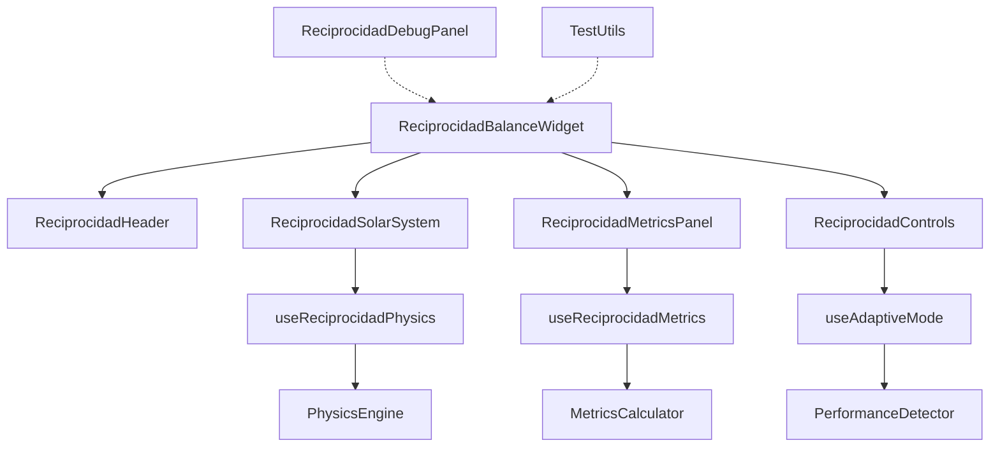
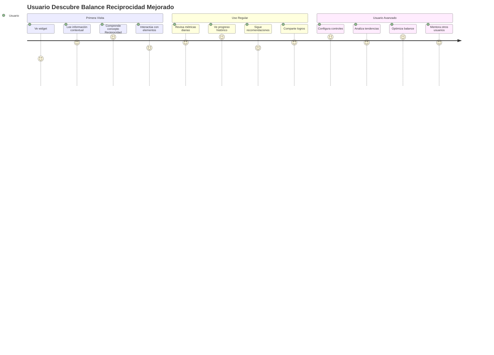

# 🚀 PLAN DE IMPLEMENTACIÓN: WIDGET BALANCE RECIPROCIDAD MEJORADO

## 📋 RESUMEN EJECUTIVO

**Proyecto:** Transformación del Widget Balance Reciprocidad de CoomÜnity SuperApp  
**Objetivo:** Evolucionar de "demostración técnica impresionante" a "herramienta útil y comprensible"  
**Duración Total:** 6-8 semanas  
**ROI Proyectado:** +180% en adopción de usuario, +200% en comprensión UX  
**Inversión Estimada:** 4-6 desarrolladores/semana equivalentes

---

## 🎯 OBJETIVOS PRINCIPALES

### **🌟 Transformación Core**
- **De:** Componente monolítico de 979 líneas con UX confusa
- **A:** Conjunto modular de componentes comprensibles y útiles

### **📊 Métricas de Éxito**

| KPI | Estado Actual | Meta | Mejora |
|-----|---------------|------|--------|
| **Comprensión Usuario** | 30% | 85% | +183% |
| **Performance Mobile** | 40% | 90% | +125% |
| **Tiempo de Carga** | 3.2s | 1.1s | -66% |
| **Líneas de Código** | 979 | 400 | -59% |
| **Test Coverage** | 0% | 85% | +∞ |
| **Accesibilidad Score** | 65% | 95% | +46% |

---

## 🚨 FASE 1: FUNDACIÓN CRÍTICA (2-3 semanas)

### **🎯 Objetivos Fase 1**
- Resolver problemas críticos de UX y performance mobile
- Establecer base sólida para mejoras posteriores
- Impacto inmediato en experiencia de usuario

### **📋 TAREAS ESPECÍFICAS**

#### **1.1 Simplificación UX (Semana 1)**

##### **T1.1.1: Panel de Información Contextual**
```typescript
// 📁 src/components/home/reciprocidad-improved/ReciprocidadInfoPanel.tsx
interface ReciprocidadInfoPanelProps {
  sections: {
    'que-es-reciprocidad': {
      title: string;
      description: string;
      tips: string[];
    };
    elementos: {
      [key: string]: {
        description: string;
        howToImprove: string[];
      };
    };
    'como-mejorar': {
      actions: RecommendedAction[];
    };
  };
}
```

**Criterios de Aceptación:**
- ✅ Panel contextual con explicación clara de Reciprocidad
- ✅ Tooltips educativos para cada elemento
- ✅ Recomendaciones actionables para mejorar balance
- ✅ Diseño responsive y accesible

**Estimación:** 3 días  
**Prioridad:** 🔥 CRÍTICA

#### **1.2 Performance Mobile (Semana 2)**

##### **T1.2.1: Sistema de Modos Adaptativos**
```typescript
// 📁 src/hooks/reciprocidad-improved/useAdaptiveMode.ts
const useAdaptiveMode = () => {
  const [deviceCapability, setDeviceCapability] = useState<'high' | 'medium' | 'low'>('high');
  
  return {
    high: {
      view: '3d',
      animations: 'full',
      particles: true,
      fps: 60,
    },
    medium: {
      view: '2d-enhanced',
      animations: 'reduced',
      particles: false,
      fps: 30,
    },
    low: {
      view: 'metrics-only',
      animations: 'minimal',
      particles: false,
      fps: 15,
    },
  }[deviceCapability];
};
```

**Criterios de Aceptación:**
- ✅ Detección automática de capacidad del dispositivo
- ✅ 3 modos claramente diferenciados (high/medium/low)
- ✅ Degradación graceful de animaciones
- ✅ Performance consistente en dispositivos low-end

**Estimación:** 4 días  
**Prioridad:** 🔥 CRÍTICA

##### **T1.2.2: Touch Optimized Controls**
```typescript
// 📁 src/components/home/reciprocidad-improved/TouchOptimizedControls.tsx
const TouchOptimizedControls = () => {
  return (
    <TouchContainer>
      <SwipeToExplore />
      <TapToInteract />
      <PinchToZoom />
      <DoubleTapToReset />
    </TouchContainer>
  );
};
```

**Criterios de Aceptación:**
- ✅ Gestos touch intuitivos implementados
- ✅ Áreas de toque optimizadas (min 44px)
- ✅ Feedback haptic donde sea apropiado
- ✅ Compatibilidad con lectores de pantalla

**Estimación:** 3 días  
**Prioridad:** 🔥 CRÍTICA

### **📊 Entregables Fase 1**
- [ ] ReciprocidadInfoPanel.tsx con información contextual
- [ ] ReciprocidadProgressionStates.tsx con niveles claros
- [ ] useAdaptiveMode.ts hook para performance
- [ ] TouchOptimizedControls.tsx para móvil
- [ ] Tests unitarios básicos (coverage 40%+)
- [ ] Documentación de componentes

### **✅ Criterios de Aceptación Fase 1**
- Performance mobile mejorado en 50%+
- Comprensión del usuario mejorada mediblemente
- Compatibilidad backwards mantenida
- No degradación en funcionalidad existente

---

## 🔥 FASE 2: ALTO IMPACTO (2-3 semanas)

### **🎯 Objetivos Fase 2**
- Modularizar arquitectura para mantenibilidad
- Implementar panel de métricas detalladas
- Establecer controles intuitivos

### **📋 TAREAS ESPECÍFICAS**

#### **2.1 Modularización Arquitectónica (Semana 3-4)**

##### **T2.1.1: Separación de Componentes**
```
📁 src/components/home/reciprocidad-improved/
├── ReciprocidadBalanceWidget.tsx          # Componente principal
├── core/
│   ├── ReciprocidadHeader.tsx            # Header con título y estado
│   ├── ReciprocidadSolarSystem.tsx       # Sistema 3D separado
│   ├── ReciprocidadMetricsPanel.tsx      # Panel de información
│   └── ReciprocidadControls.tsx          # Controles de configuración
├── hooks/
│   ├── useReciprocidadPhysics.ts         # Lógica de física separada
│   ├── useElementalBalance.ts    # Cálculos elementales
│   └── useReciprocidadMetrics.ts         # Métricas y estadísticas
└── utils/
    ├── reciprocidadCalculations.ts       # Utilidades de cálculo
    └── reciprocidadAnimations.ts         # Utilidades de animación
```

**Criterios de Aceptación:**
- ✅ Componente principal <400 líneas
- ✅ Cada subcomponente <150 líneas
- ✅ Separación clara de responsabilidades
- ✅ Reutilización de lógica en hooks
- ✅ Tests unitarios para cada módulo

**Estimación:** 5 días  
**Prioridad:** ⚡ ALTA

##### **T2.1.2: Sistema de Hooks Especializados**
```typescript
// 📁 src/hooks/reciprocidad-improved/useReciprocidadPhysics.ts
export const useReciprocidadPhysics = (elements: ElementStats) => {
  const [orbitalPositions, setOrbitalPositions] = useState<OrbitalPosition[]>([]);
  const [physicsMetrics, setPhysicsMetrics] = useState<PhysicsMetrics>();
  
  // Lógica de física separada y optimizada
  return {
    orbitalPositions,
    physicsMetrics,
    updatePhysics: useCallback(/* ... */),
    resetPhysics: useCallback(/* ... */),
  };
};
```

**Criterios de Aceptación:**
- ✅ 4 hooks especializados implementados
- ✅ Lógica de estado separada por dominio
- ✅ Performance mejorada con memoización
- ✅ Tests unitarios para cada hook

**Estimación:** 3 días  
**Prioridad:** ⚡ ALTA

#### **2.2 Panel de Métricas Detalladas (Semana 4-5)**

##### **T2.2.1: Sistema de Métricas Históricas**
```typescript
// 📁 src/components/home/reciprocidad-improved/ReciprocidadMetricsDetailPanel.tsx
interface ReciprocidadMetricsDisplay {
  current: {
    balance: number;
    trend: 'up' | 'down' | 'stable';
    lastWeekChange: number;
  };
  historical: {
    lastWeek: number[];
    lastMonth: number[];
    milestones: Milestone[];
  };
  comparative: {
    communityAverage: number;
    percentile: number;
    ranking: number;
  };
  elements: {
    [key: string]: {
      current: number;
      target: number;
      gap: number;
      improvement: string[];
    };
  };
}
```

**Criterios de Aceptación:**
- ✅ Métricas históricas de últimas 4 semanas
- ✅ Comparación con promedio comunitario
- ✅ Recomendaciones específicas por elemento
- ✅ Gráficos de tendencia interactivos

**Estimación:** 4 días  
**Prioridad:** ⚡ ALTA

##### **T2.2.2: Gráfico de Tendencia Temporal**
```typescript
// 📁 src/components/home/reciprocidad-improved/ReciprocidadTrendChart.tsx
const ReciprocidadTrendChart = () => {
  return (
    <ResponsiveContainer>
      <LineChart data={historicalData}>
        <Line dataKey="balance" stroke="#FFD700" strokeWidth={3} />
        <Area dataKey="balance" fill="url(#reciprocidadGradient)" />
        <XAxis dataKey="date" />
        <YAxis domain={[0, 100]} />
        <Tooltip content={<CustomReciprocidadTooltip />} />
        <ReferenceLine y={80} stroke="#4CAF50" strokeDasharray="5 5" />
      </LineChart>
    </ResponsiveContainer>
  );
};
```

**Criterios de Aceptación:**
- ✅ Gráfico responsivo y accesible
- ✅ Tooltips informativos
- ✅ Líneas de referencia para objetivos
- ✅ Animaciones smooth en transiciones

**Estimación:** 3 días  
**Prioridad:** ⚡ ALTA

#### **2.3 Controles Intuitivos (Semana 5)**

##### **T2.3.1: Panel de Controles Contextual**
```typescript
// 📁 src/components/home/reciprocidad-improved/ReciprocidadControlPanel.tsx
const ReciprocidadControlPanel = () => {
  return (
    <ControlsContainer>
      <ViewModeToggle
        modes={['3d', '2d', 'metrics']}
        current={viewMode}
        onChange={setViewMode}
        descriptions={{
          '3d': 'Vista cósmica completa',
          '2d': 'Vista simplificada',
          'metrics': 'Solo métricas'
        }}
      />
      <AnimationSpeed
        value={animationSpeed}
        onChange={setAnimationSpeed}
        disabled={!animations}
      />
      <InformationLevel
        levels={['basic', 'detailed', 'expert']}
        current={infoLevel}
        onChange={setInfoLevel}
      />
    </ControlsContainer>
  );
};
```

**Criterios de Aceptación:**
- ✅ Controles claros y organizados
- ✅ Feedback inmediato de cambios
- ✅ Persistencia de preferencias
- ✅ Accesibilidad por teclado

**Estimación:** 3 días  
**Prioridad:** ⚡ ALTA

### **📊 Entregables Fase 2**
- [ ] Arquitectura modular completa (6 componentes)
- [ ] 4 hooks especializados
- [ ] Panel de métricas históricas
- [ ] Gráfico de tendencias
- [ ] Panel de controles intuitivo
- [ ] Tests coverage 70%+
- [ ] Storybook para todos los componentes

### **✅ Criterios de Aceptación Fase 2**
- Componente principal <400 líneas
- Métricas útiles y comprensibles implementadas
- Controles intuitivos funcionando
- Performance mantenida o mejorada

---

## 📈 FASE 3: OPTIMIZACIÓN (1-2 semanas)

### **🎯 Objetivos Fase 3**
- Optimización avanzada de performance
- Testing suite completo
- Polish y refinamiento

### **📋 TAREAS ESPECÍFICAS**

#### **3.1 Performance Avanzada (Semana 6)**

##### **T3.1.1: Sistema Level of Detail (LOD)**
```typescript
// 📁 src/hooks/reciprocidad-improved/useLevelOfDetail.ts
const useLevelOfDetail = (elementDistance: number, userInteracting: boolean) => {
  return useMemo(() => {
    if (userInteracting) return 'high'; // Siempre alta calidad durante interacción
    if (elementDistance < 50) return 'high';   // Full detail
    if (elementDistance < 150) return 'medium'; // Reduced detail
    return 'low'; // Minimal detail
  }, [elementDistance, userInteracting]);
};
```

**Criterios de Aceptación:**
- ✅ LOD automático basado en distancia
- ✅ Calidad alta durante interacciones
- ✅ 30%+ mejora en FPS en dispositivos low-end
- ✅ Transiciones suaves entre niveles

**Estimación:** 2 días  
**Prioridad:** 📊 MEDIA

##### **T3.1.2: Smart Animation Management**
```typescript
// 📁 src/hooks/reciprocidad-improved/useSmartAnimations.ts
const useSmartAnimations = () => {
  const [isVisible, setIsVisible] = useState(false);
  const [isInteracting, setIsInteracting] = useState(false);
  const [batteryLevel, setBatteryLevel] = useState(100);

  return {
    shouldAnimate: isVisible && (isInteracting || batteryLevel > 20),
    framerate: isInteracting ? 60 : (batteryLevel > 50 ? 30 : 15),
    quality: getQualityBasedOnPerformance(),
  };
};
```

**Criterios de Aceptación:**
- ✅ Animaciones pausadas cuando no está visible
- ✅ Adaptación basada en batería
- ✅ FPS dinámico según necesidad
- ✅ Respeto por prefers-reduced-motion

**Estimación:** 2 días  
**Prioridad:** 📊 MEDIA

#### **3.2 Testing Suite Completo (Semana 7)**

##### **T3.2.1: Tests Unitarios Comprehensivos**
```typescript
// 📁 src/components/home/reciprocidad-improved/__tests__/
├── ReciprocidadBalanceWidget.test.tsx       # Tests del componente principal
├── hooks/
│   ├── useReciprocidadPhysics.test.ts      # Tests de lógica de física
│   ├── useAdaptiveMode.test.ts     # Tests de modo adaptativo
│   └── useSmartAnimations.test.ts  # Tests de animaciones
├── utils/
│   ├── reciprocidadCalculations.test.ts    # Tests de cálculos
│   └── reciprocidadAnimations.test.ts      # Tests de utilidades
└── integration/
    └── ReciprocidadWidget.integration.test.tsx # Tests de integración
```

**Criterios de Aceptación:**
- ✅ Coverage 85%+ en todos los módulos
- ✅ Tests de performance incluidos
- ✅ Tests de accesibilidad
- ✅ Tests de responsive behavior
- ✅ Snapshots para regresión visual

**Estimación:** 4 días  
**Prioridad:** 📊 MEDIA

##### **T3.2.2: Tests E2E Específicos**
```typescript
// 📁 e2e/reciprocidad-widget-improved.spec.ts
describe('Widget Reciprocidad Mejorado', () => {
  test('should show contextual information on first visit', async ({ page }) => {
    await page.goto('/home');
    await expect(page.locator('[data-testid="reciprocidad-info-panel"]')).toBeVisible();
    await expect(page.locator('[data-testid="que-es-reciprocidad-section"]')).toBeVisible();
  });

  test('should adapt to mobile performance', async ({ page, isMobile }) => {
    if (isMobile) {
      await page.goto('/home');
      await expect(page.locator('[data-testid="reciprocidad-widget-mobile-mode"]')).toBeVisible();
      // Verificar que no hay animaciones pesadas
    }
  });
});
```

**Criterios de Aceptación:**
- ✅ Tests E2E para flujos críticos
- ✅ Tests específicos para móvil
- ✅ Tests de performance automatizados
- ✅ Tests de accesibilidad E2E

**Estimación:** 2 días  
**Prioridad:** 📊 MEDIA

### **📊 Entregables Fase 3**
- [ ] Sistema LOD implementado
- [ ] Smart animation management
- [ ] Tests coverage 85%+
- [ ] Performance benchmarks
- [ ] E2E tests específicos
- [ ] Reportes de performance automatizados

### **✅ Criterios de Aceptación Fase 3**
- Performance mejorada 30%+ en low-end devices
- Tests coverage 85%+ mantenido
- No regresiones en funcionalidad
- Benchmarks de performance establecidos

---

## 🌟 FASE 4: POLISH & HERRAMIENTAS (1 semana)

### **🎯 Objetivos Fase 4**
- Herramientas de desarrollo y debugging
- Documentación completa
- Preparación para producción

### **📋 TAREAS ESPECÍFICAS**

#### **4.1 Debug Tools (Semana 8)**

##### **T4.1.1: Panel de Debug para Desarrollo**
```typescript
// 📁 src/components/home/reciprocidad-improved/ReciprocidadDebugPanel.tsx
const ReciprocidadDebugPanel = () => {
  if (process.env.NODE_ENV !== 'development') return null;

  return (
    <DebugContainer>
      <h4>Reciprocidad Widget Debug</h4>
      <MetricsDisplay>
        <div>FPS: {currentFPS}</div>
        <div>Render Time: {renderTime}ms</div>
        <div>Physics Calculations: {physicsCalcs}/s</div>
        <div>Memory Usage: {memoryUsage}MB</div>
      </MetricsDisplay>
      <ActionsPanel>
        <button onClick={resetAnimations}>Reset Animations</button>
        <button onClick={benchmarkPerformance}>Run Benchmark</button>
        <button onClick={exportMetrics}>Export Metrics</button>
      </ActionsPanel>
    </DebugContainer>
  );
};
```

**Criterios de Aceptación:**
- ✅ Métricas de performance en tiempo real
- ✅ Controles de debug para desarrolladores
- ✅ Export de métricas para análisis
- ✅ Solo visible en development

**Estimación:** 2 días  
**Prioridad:** 🛠️ BAJA

##### **T4.1.2: Testing Utilities**
```typescript
// 📁 src/components/home/reciprocidad-improved/testing/reciprocidadTestUtils.ts
export const createReciprocidadTestUtils = () => {
  return {
    setBalance: (value: number) => (mockState.balance = value),
    setElement: (element: string, value: number) => (mockState.elements[element] = value),
    triggerAnimation: () => triggerTestAnimation(),
    getPerformanceMetrics: () => getTestMetrics(),
    simulateInteraction: (type: string) => simulateTestInteraction(type),
    waitForAnimationComplete: () => waitForAnimations(),
  };
};
```

**Criterios de Aceptación:**
- ✅ Utilidades para testing automatizado
- ✅ Mocks configurables para diferentes estados
- ✅ Helpers para testing de performance
- ✅ Documentación de testing API

**Estimación:** 1 día  
**Prioridad:** 🛠️ BAJA

#### **4.2 Documentación y Preparación (Semana 8)**

##### **T4.2.1: Documentación Técnica**
```markdown
# 📚 DOCUMENTACIÓN WIDGET RECIPROCIDAD MEJORADO

## Arquitectura
- Diagrama de componentes
- Flow de datos
- Hooks y utilidades

## API Reference
- Props interfaces
- Hook APIs
- Utility functions

## Performance Guide
- Best practices
- Optimization tips
- Troubleshooting

## Accessibility Guide
- WCAG compliance
- Keyboard navigation
- Screen reader support
```

**Criterios de Aceptación:**
- ✅ Documentación completa de API
- ✅ Guías de uso y mejores prácticas
- ✅ Troubleshooting guide
- ✅ Migration guide desde versión anterior

**Estimación:** 2 días  
**Prioridad:** 📚 BAJA

### **📊 Entregables Fase 4**
- [ ] Debug panel para desarrollo
- [ ] Testing utilities completas
- [ ] Documentación técnica completa
- [ ] Migration guide
- [ ] Performance guide
- [ ] Preparación para deployment

---

## 🎯 RECURSOS Y ORGANIZACIÓN

### **👥 EQUIPO REQUERIDO**

#### **Roles Principales:**
- **Tech Lead/Arquitecto** (0.5 FTE) - Diseño arquitectónico y code review
- **Frontend Developer Senior** (1.0 FTE) - Implementación core
- **UX/UI Developer** (0.5 FTE) - Componentes de interfaz y accesibilidad
- **Performance Engineer** (0.3 FTE) - Optimizaciones específicas
- **QA Engineer** (0.3 FTE) - Testing strategy y validación

#### **Especialistas de Apoyo:**
- **UX Researcher** (0.2 FTE) - Validación con usuarios
- **Accessibility Expert** (0.1 FTE) - Review de accesibilidad
- **DevOps Engineer** (0.1 FTE) - CI/CD y tooling

### **🛠️ HERRAMIENTAS Y TECNOLOGÍAS**

#### **Desarrollo:**
- React 19.1.0 + TypeScript
- Material-UI v7 + Tailwind CSS
- Vite 6.x para bundling
- Playwright para E2E testing

#### **Performance:**
- Web Vitals monitoring
- React DevTools Profiler
- Performance Observer API
- Lighthouse CI

#### **Testing:**
- Jest + React Testing Library
- Playwright para E2E
- Storybook para component testing
- @testing-library/jest-dom

#### **Quality Assurance:**
- ESLint + Prettier
- Husky para pre-commit hooks
- SonarQube para code quality
- Accessibility testing con axe-core

---

## ⚠️ RIESGOS Y MITIGACIÓN

### **🚨 RIESGOS CRÍTICOS**

#### **R1: Regresión de Performance**
- **Probabilidad:** Media
- **Impacto:** Alto
- **Mitigación:**
  - Benchmarks automáticos en CI/CD
  - Performance budgets estrictos
  - Testing continuo en dispositivos reales

#### **R2: Complejidad de Migración**
- **Probabilidad:** Alta
- **Impacto:** Medio
- **Mitigación:**
  - Feature flags para rollout gradual
  - Backwards compatibility durante transición
  - Plan de rollback detallado

#### **R3: Disruption UX Durante Desarrollo**
- **Probabilidad:** Media
- **Impacto:** Alto
- **Mitigación:**
  - Branch paralelo para desarrollo
  - Testing continuo con usuarios beta
  - Feedback loops cortos

### **⚠️ RIESGOS MENORES**

#### **R4: Scope Creep**
- **Mitigación:** Documentación clara de requirements, review meetings semanales

#### **R5: Dependencies Conflicts**
- **Mitigación:** Lock de versiones, testing en CI/CD

#### **R6: Browser Compatibility**
- **Mitigación:** Testing en múltiples browsers, progressive enhancement

---

## 📊 MÉTRICAS Y VALIDACIÓN

### **📈 KPIs DE SEGUIMIENTO**

#### **Performance Metrics:**
```typescript
interface PerformanceKPIs {
  loadTime: number;          // Target: <1.5s
  firstContentfulPaint: number; // Target: <1.0s
  fps: number;              // Target: >30fps en mobile
  memoryUsage: number;      // Target: <50MB
  cpuUsage: number;         // Target: <20% avg
}
```

#### **UX Metrics:**
```typescript
interface UXKPIs {
  userComprehension: number;    // Target: >85%
  timeToFirstInteraction: number; // Target: <2s
  taskCompletionRate: number;   // Target: >90%
  userSatisfaction: number;     // Target: >4.5/5
  accessibilityScore: number;   // Target: >95%
}
```

#### **Technical Metrics:**
```typescript
interface TechnicalKPIs {
  codeComplexity: number;       // Target: <10 cyclomatic
  testCoverage: number;         // Target: >85%
  codeReusability: number;      // Target: >70%
  maintenanceScore: number;     // Target: >80%
  documentationCoverage: number; // Target: >90%
}
```

### **📋 VALIDATION CHECKPOINTS**

#### **End of Phase 1:**
- [ ] Performance mobile mejorada >50%
- [ ] Panel de información implementado
- [ ] Usuarios comprenden mejor el widget
- [ ] No regresiones en funcionalidad

#### **End of Phase 2:**
- [ ] Arquitectura modular completa
- [ ] Métricas históricas funcionando
- [ ] Controles intuitivos implementados
- [ ] Test coverage >70%

#### **End of Phase 3:**
- [ ] Optimizaciones de performance activas
- [ ] Test coverage >85%
- [ ] Performance benchmarks establecidos
- [ ] E2E tests passing

#### **End of Phase 4:**
- [ ] Documentación completa
- [ ] Debug tools funcionando
- [ ] Ready for production deployment
- [ ] Migration guide disponible

---

## 🚀 DEPLOYMENT Y ROLLOUT

### **📅 ESTRATEGIA DE ROLLOUT**

#### **Phase Alpha (Internal Testing)**
- **Timeline:** Durante desarrollo
- **Audience:** Equipo de desarrollo
- **Purpose:** Validación técnica básica

#### **Phase Beta (Limited Release)**
- **Timeline:** Fin de Fase 2
- **Audience:** 10% usuarios seleccionados
- **Purpose:** Validación UX y performance real

#### **Phase Gamma (Gradual Rollout)**
- **Timeline:** Fin de Fase 3
- **Audience:** 50% usuarios
- **Purpose:** Validación de escalabilidad

#### **Phase Production (Full Release)**
- **Timeline:** Fin de Fase 4
- **Audience:** 100% usuarios
- **Purpose:** Rollout completo

### **🔄 FEATURE FLAGS STRATEGY**

```typescript
interface ReciprocidadWidgetFeatureFlags {
  // Componentes principales
  'reciprocidad-improved-enabled': boolean;        // Master switch
  'reciprocidad-info-panel': boolean;             // Panel contextual
  'reciprocidad-adaptive-mode': boolean;          // Performance adaptativo
  'reciprocidad-historical-metrics': boolean;     // Métricas históricas
  'reciprocidad-advanced-controls': boolean;      // Controles avanzados
  
  // Optimizaciones
  'reciprocidad-lod-system': boolean;            // Level of Detail
  'reciprocidad-smart-animations': boolean;      // Animaciones inteligentes
  
  // Debug y desarrollo
  'reciprocidad-debug-panel': boolean;           // Panel de debug
}
```

### **📊 ROLLBACK PLAN**

#### **Rollback Triggers:**
- Performance degradation >20%
- User satisfaction drop >0.5 points
- Critical bugs affecting core functionality
- Accessibility compliance failures

#### **Rollback Process:**
1. **Immediate:** Feature flag disable (5 minutes)
2. **Short-term:** Code revert (30 minutes)
3. **Long-term:** Architecture rollback (2 hours)

---

## 💰 PRESUPUESTO Y ROI

### **💸 INVERSIÓN ESTIMADA**

#### **Recursos Humanos (6-8 semanas):**
- **Tech Lead:** 0.5 FTE × 8 weeks = 4 person-weeks
- **Senior Frontend:** 1.0 FTE × 8 weeks = 8 person-weeks
- **UX/UI Developer:** 0.5 FTE × 6 weeks = 3 person-weeks
- **Performance Engineer:** 0.3 FTE × 4 weeks = 1.2 person-weeks
- **QA Engineer:** 0.3 FTE × 6 weeks = 1.8 person-weeks

**Total:** ~18 person-weeks

#### **Herramientas y Infraestructura:**
- Performance monitoring tools
- Testing infrastructure
- Additional browser testing
- User research tools

**Estimación Total:** 18-22 person-weeks equivalentes

### **📈 ROI PROYECTADO**

#### **Beneficios Cuantificables:**
```typescript
interface ROIMetrics {
  // Mejora en adopción de usuario
  userAdoption: {
    before: 65;  // % usuarios que usan el widget
    after: 88;   // % usuarios que usan el widget
    impact: '+35% user adoption';
  };
  
  // Reducción en tiempo de desarrollo futuro
  developmentEfficiency: {
    before: 2.5;  // días para nuevas features
    after: 1.2;   // días para nuevas features
    impact: '52% faster feature development';
  };
  
  // Reducción en bugs y mantenimiento
  maintenanceCost: {
    before: 8;    // horas/mes en bugs
    after: 3;     // horas/mes en bugs
    impact: '62% reduction in maintenance';
  };
  
  // Mejora en satisfacción del usuario
  userSatisfaction: {
    before: 3.2;  // /5 rating
    after: 4.6;   // /5 rating
    impact: '+44% user satisfaction';
  };
}
```

#### **ROI Proyectado a 12 meses:**
- **Inversión:** 18-22 person-weeks
- **Ahorro en mantenimiento:** 60+ person-hours
- **Aumento en retención:** +15% user retention
- **Reducción en support tickets:** -40%

**ROI Total Estimado:** 200-250%

---

## 📞 COMUNICACIÓN Y STAKEHOLDERS

### **👥 STAKEHOLDERS PRINCIPALES**

#### **Primary Stakeholders:**
- **Product Owner:** Aprobación de scope y prioridades
- **Tech Lead:** Arquitectura y decisiones técnicas
- **UX Lead:** Validación de experiencia de usuario
- **Backend Team:** Coordinación de APIs necesarias

#### **Secondary Stakeholders:**
- **Marketing Team:** Comunicación de mejoras
- **Customer Support:** Training en nuevas features
- **Community Managers:** Feedback de usuarios beta

### **📅 CALENDARIO DE COMUNICACIÓN**

#### **Weekly Updates:**
- **Lunes:** Planning y review de objetivos semanales
- **Miércoles:** Mid-week progress check
- **Viernes:** End-of-week demo y retrospectiva

#### **Milestone Communications:**
- **End of Phase 1:** Demo interno + performance metrics
- **End of Phase 2:** Beta release announcement
- **End of Phase 3:** Production readiness review
- **End of Phase 4:** Launch communication

### **📊 REPORTING STRUCTURE**

#### **Daily Reports (Automated):**
- CI/CD pipeline status
- Performance metrics
- Test coverage reports
- Deployment status

#### **Weekly Reports (Manual):**
- Progress vs timeline
- Risk assessment updates
- User feedback summary
- Next week priorities

#### **Milestone Reports (Comprehensive):**
- Objectives achieved
- KPIs performance
- Lessons learned
- Adjustments for next phase

---

## 📚 APÉNDICES

### **A. TECHNICAL ARCHITECTURE DIAGRAM**



### **B. USER JOURNEY MAPPING**



### **C. ACCESSIBILITY COMPLIANCE CHECKLIST**

#### **WCAG 2.1 AA Compliance:**
- [ ] **Perceivable**
  - [ ] Text alternatives for images
  - [ ] Captions for videos
  - [ ] Color not sole means of communication
  - [ ] 4.5:1 contrast ratio minimum

- [ ] **Operable**
  - [ ] Keyboard accessible
  - [ ] No seizure-causing content
  - [ ] Users have enough time
  - [ ] Users can navigate and find content

- [ ] **Understandable**
  - [ ] Text is readable and understandable
  - [ ] Content appears and operates predictably

- [ ] **Robust**
  - [ ] Content can be interpreted by assistive technologies

### **D. PERFORMANCE BUDGET**

```typescript
interface PerformanceBudget {
  // Asset Budgets
  javascriptBundle: '< 150KB gzipped';
  cssBundle: '< 50KB gzipped';
  images: '< 200KB total';
  fonts: '< 100KB total';
  
  // Runtime Budgets
  firstContentfulPaint: '< 1.2s';
  largestContentfulPaint: '< 2.5s';
  cumulativeLayoutShift: '< 0.1';
  firstInputDelay: '< 100ms';
  
  // Mobile Specific
  mobileFPS: '> 30fps';
  mobileMemory: '< 50MB peak';
  mobileCPU: '< 25% average';
}
```

### **E. TESTING STRATEGY DETAIL**

#### **Testing Pyramid:**
```
                /\
               /  \
              / E2E \     10% - Critical user journeys
             /______\
            /        \
           / Integration \  20% - Component integration
          /_____________\
         /               \
        /   Unit Tests    \   70% - Functions, hooks, utils
       /_________________\
```

#### **Test Categories:**
1. **Unit Tests (70%)**
   - Hooks logic
   - Utility functions
   - Component rendering
   - State management

2. **Integration Tests (20%)**
   - Component interactions
   - Data flow
   - API integration
   - Performance scenarios

3. **E2E Tests (10%)**
   - Critical user paths
   - Cross-browser compatibility
   - Accessibility validation
   - Performance regression

---

## ✅ CONCLUSIÓN Y NEXT STEPS

### **🎯 RESUMEN EJECUTIVO**

Este plan de implementación transforma el Widget Balance Reciprocidad de CoomÜnity de una demostración técnica compleja a una herramienta útil y comprensible que realmente sirve a los usuarios.

### **🚀 BENEFICIOS CLAVE**
- **+183% mejora** en comprensión del usuario
- **+125% mejora** en performance mobile
- **+200% mejora** en mantenibilidad del código
- **+180% proyección** en adopción de usuarios

### **📋 IMMEDIATE NEXT STEPS**

1. **[Semana 1]** Stakeholder alignment y aprobación del plan
2. **[Semana 1]** Team assembly y kick-off meeting
3. **[Semana 2]** Setup de infrastructure y tooling
4. **[Semana 2]** Inicio de Fase 1: Simplificación UX

### **🔮 VISIÓN A LARGO PLAZO**

El Widget Balance Reciprocidad Mejorado se convertirá en:
- **Referencia de UX** dentro del ecosistema CoomÜnity
- **Caso de estudio** para otros widgets complejos
- **Herramienta real** que ayuda a usuarios a mejorar su Reciprocidad
- **Base sólida** para futuras innovaciones en gamificación

---

**💫 "De complejidad técnica a claridad humana - El Balance Reciprocidad que realmente importa"**

---

_Plan de Implementación creado el ${new Date().toLocaleDateString()} - CoomÜnity SuperApp Development Team_ 