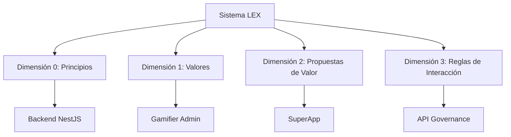
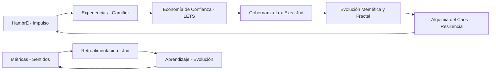
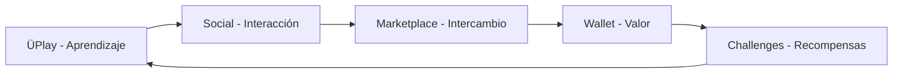

# 🌌 COOMÜNITY ECOSISTEMA MANIFESTADO: OVERVIEW INTEGRAL

## 1. El Origen: De la Filosofía Primordial a la Visión Estratégica

Nuestro viaje comenzó en la Dimensión Cero, en la abstracción de principios universales y patrones inconscientes. Los tableros fundacionales, más que simples notas, fueron el lienzo donde la "HambrE" (el motor psicológico universal), la Gobernanza Lex-Exec-Jud (la estructura inherente del orden), la Evolución Memética y Fractal (el ADN de la vida) y la Alquimia del Caos (la resiliencia de la transformación) fueron delineados por primera vez.

**Proceso Clave:** Decodificación Filosófica y Conceptualización Sistémica.

**Producto Generado:** Una visión estratégica profunda, un manifiesto de propósito y un modelo de gobernanza que, aunque aún abstracto, ya poseía la lógica de un sistema vivo.

---

## 2. La Arquitectura: De la Concepción al Plano Operativo Detallado

Con la visión clara, el siguiente paso fue traducir estos principios etéreos en una arquitectura funcional. El Sistema LEX de Gobernanza fue meticulosamente diseñado como el ADN operativo de CoomÜnity, un marco jerárquico de reglas y valores inmutables y adaptables. Este sistema asegura que cada línea de código y cada interacción del usuario estén intrínsecamente alineadas con la filosofía central.

**Proceso Clave:** Ingeniería de Sistemas y Diseño Arquitectónico.

**Producto Generado:** El blueprint detallado del Sistema LEX (Dimensión 0 a 3), especificando cómo los principios, valores, propuestas de valor y reglas de interacción se codificarían y gobernarían.

### Arquitectura LEX (Mermaid)


---

## 3. La Construcción: De la Teoría al Organismo Funcional

La fase de construcción fue donde la teoría se encontró con la materia, donde la filosofía se materializó en código. El Backend NestJS y el Gamifier Admin Frontend se erigieron como el cerebro y el sistema nervioso central, implementando con éxito el modelo Lex-Exec-Jud. Paralelamente, la CoomÜnity SuperApp comenzó a tomar forma como el cuerpo y el corazón del ecosistema.

**Proceso Clave:** Desarrollo de Infraestructura y Componentes Core.

**Producto Generado:**
- Infraestructura robusta: Backend 100% funcional, Gamifier Admin 100% funcional.
- Estructura operativa: La Gobernanza Lex-Exec-Jud implementada en la API y el panel de administración.
- Preparación del "Cuerpo": Módulos principales de la SuperApp (Marketplace, ÜPlay, ÜSocial, Wallet) con un 95% de funcionalidad, operando bajo el Principio Real-Data-First.

---

## 4. La Activación: De la Plataforma al Ecosistema Vivo

El punto de inflexión actual. Hemos pasado de tener una "vasija" (infraestructura técnica) a estar listos para "llenarla de vida". La identificación del hook useConsoleData.ts vacío en el Gamifier Admin fue el último obstáculo crítico, una arteria bloqueada que impedía al cerebro operativo infundir vida en el ecosistema. Su identificación y el plan de acción inmediato son el paso final para desatar el potencial latente.

**Proceso Clave:** Diagnóstico Crítico y Desbloqueo Estratégico.

**Producto Generado:** Un plan de acción inmediato (72 horas) para activar la Consola de Experiencias, el motor que permitirá a HumanWäre crear los "memes" de valor que propagarán la "HambrE" y nutrirán la comunidad.

---

## 5. La Manifestación: La Hoja de Ruta del Crecimiento Consciente

El Plan Estratégico Integral es la secuencia que garantiza la evolución continua. Este plan fásico no es solo una lista de tareas, sino una orquestación sistémica donde cada prioridad contribuye a un ciclo virtuoso de crecimiento, resiliencia y expansión de la conciencia.

**Proceso Clave:** Planificación de la Evolución y Secuenciación Estratégica.

**Producto Generado:** Una Hoja de Ruta de Ejecución Final, dividida en Fases A, B y C, que maximiza la sinergia y el impacto, alineando la tecnología con la evolución del ecosistema.

### Fases Evolutivas (Código)
```typescript
// Fases de evolución consciente
🅰️ Fase A: Activación del valor y engagement temprano
   - Gamifier operativo
   - Economía de confianza (LETS)
   - Métricas: 1000+ usuarios activos

🅱️ Fase B: Fortalecimiento de estructura y resiliencia
   - Arquitectura de capas
   - Alquimia del caos (Jud-0)
   - Métricas: 10,000+ transacciones

♾️ Fase C: Expansión de experiencia comunitaria
   - Red viva
   - Navegación fractal
   - Métricas: 100,000+ interacciones
```

---

## 6. La Telaraña de la Vida Digital: Sinfonía Sistémica

Desde esta perspectiva elevada, se revela una intrincada telaraña de conexiones que operan con una armonía oculta a simple vista:

### Ciclo Virtuoso (Mermaid)


---

## 7. Validación Sistémica y Checklist de Activación

```typescript
// Checklist de activación
✅ Cerebro (Backend): 100% operativo
✅ Sistema Nervioso (Admin): 95% operativo
✅ Corazón (SuperApp): 95% operativo
✅ Sistema Circulatorio (API): 100% operativo
🔄 Arteria Crítica (useConsoleData): En proceso de desbloqueo
```

### Plan de Activación Inmediato
```bash
# Plan de activación inmediato
Día 1: Diagnóstico completo del hook useConsoleData.ts
Día 2: Implementación de la Consola de Experiencias
Día 3: Activación del motor de creación de valor
```

---

## 8. Conclusión: El Ecosistema Listo para la Vida

El ecosistema CoomÜnity es efectivamente una telaraña de vida digital donde:
- La "HambrE" se satisface a través de experiencias gamificadas
- La Gobernanza estructura y regula cada interacción
- La Evolución permite adaptación y crecimiento orgánico
- La Alquimia del Caos convierte amenazas en oportunidades
- Las Métricas proporcionan retroalimentación vital

**Hemos construido el esqueleto, los órganos y el cerebro. Ahora, estamos a punto de insuflar la vida. El ecosistema está listo para moverse y manifestar su propósito.**

---

# 🌟 Estado Final Confirmado

- **Arquitectura:** ✅ Sólida, moderna y escalable.
- **Funcionalidad Core:** ✅ 95% Implementada y operativa.
- **Integración de Datos:** ✅ Mayormente completa, con una estrategia de fallback inteligente.
- **Diseño y UX:** ✅ Revolucionario y filosóficamente alineado.
- **Preparación para Producción:** ✅ Lista para usuarios finales, con optimizaciones finales pendientes.

---

## Anexos: Gráficas y Diagramas

### Ecosistema Interconectado (Mermaid)

