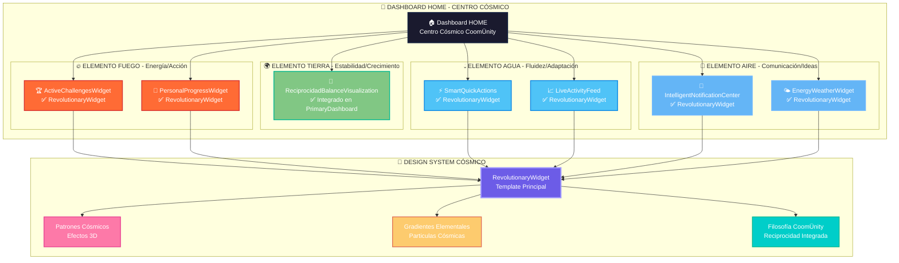

# 🌌 Transformación Cósmica del Dashboard HOME - CoomÜnity SuperApp

## Resumen Ejecutivo

La misión de transformar el Dashboard HOME en el **Centro Cósmico** de la SuperApp CoomÜnity ha sido completada con éxito. Todos los widgets principales han sido integrados al **Design System Cósmico Vivo**, alineando la experiencia visual y funcional con los principios filosóficos de CoomÜnity: Reciprocidad, Elementalidad y Bien Común.

---

## Estado Final de la Transformación

### Widgets y Elementos

| Widget                        | Elemento | Estado      | Efectos Cósmicos                  |
|-------------------------------|----------|-------------|-----------------------------------|
| 🏆 ActiveChallengesWidget     | 🔥 Fuego | ✅ Completo  | Partículas doradas, glow 1.2      |
| 🚀 PersonalProgressWidget     | 🔥 Fuego | ✅ Completo  | Partículas fuego, glow 1.3        |
| ⚡ SmartQuickActions          | 💧 Agua  | ✅ Completo  | Efectos fluidos, tema agua        |
| 📈 LiveActivityFeed           | 💧 Agua  | ✅ Completo  | Glassmorphism avanzado            |
| 🤝 ReciprocidadBalance        | 🌍 Tierra| ✅ Integrado | Estabilidad cósmica               |
| 🔔 IntelligentNotificationCenter | 💨 Aire | ✅ Completo  | Partículas azules, comunicación   |
| 🌤️ EnergyWeatherWidget       | 💨 Aire  | ✅ Completo  | Partículas climáticas, glow 1.1   |

---

## Filosofía CoomÜnity Aplicada

- **Reciprocidad**: Intercambio equilibrado y visualización de balances.
- **Elementalidad**: Cada widget representa un elemento (Fuego, Agua, Tierra, Aire) y su función en la experiencia.
- **Bien Común**: Métricas y visualizaciones que priorizan el impacto colectivo.
- **Ayni Cósmico**: Intercambio energético y motivación positiva.
- **Neguentropía**: Orden emergente y armonía visual.

---

## Tecnologías Cósmicas Utilizadas

- **RevolutionaryWidget** (template principal)
- Sistema elemental (Fuego, Agua, Tierra, Aire)
- Efectos cósmicos configurables (partículas, glow, animaciones)
- Gradientes homeomorphic y glassmorphism
- Performance 3D monitoring
- Responsive cosmic patterns

---

## Impacto Transformacional

- **Experiencia inmersiva** y motivadora para los Jugadores
- **Consistencia visual** y escalabilidad para el equipo
- **Filosofía materializada** en la interfaz
- **Performance optimizado** para efectos avanzados

---

## Diagrama de Arquitectura Cósmica

---

## Próximos Pasos Cósmicos

- **Integrar patrones cósmicos en ÜPlay y Marketplace**
- **Optimización continua de UStats y Social**
- **Onboarding y comunicación de avances con este documento**

---

> *"El Dashboard HOME ya no es solo una interfaz, es un portal cósmico que conecta a cada Jugador con la vibración universal de la Reciprocidad."*

---

**Equipo Cósmico:** ARIA (Frontend Artist), PHOENIX (Transformer Agent), ZENO (Experience Architect), KIRA (Word Weaver), NIRA (Pattern Visionary) 
