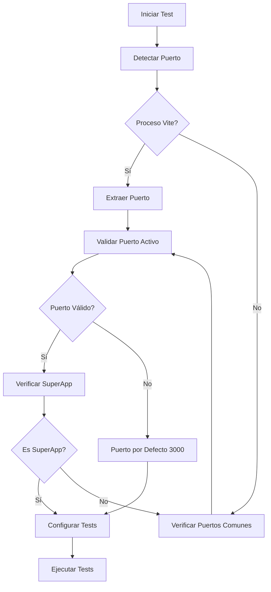

# 🎯 Sistema de Detección Automática de Puertos para Testing

## 📋 Problema Resuelto

Anteriormente, cuando la SuperApp se ejecutaba en puertos dinámicos (3005, 3006, etc.) debido a conflictos de puerto, los tests de Playwright fallaban porque estaban configurados para usar un puerto fijo (3000). Esto causaba:

- ❌ Pérdida de tiempo cambiando configuraciones manualmente
- ❌ Consumo innecesario de tokens de IA
- ❌ Errores frecuentes en testing
- ❌ Flujo de desarrollo interrumpido

## ✅ Solución Implementada

### **Detección Automática Inteligente**

El sistema detecta automáticamente el puerto activo de la SuperApp usando múltiples estrategias:

1. **Análisis de Procesos**: Busca procesos de Vite relacionados con SuperApp
2. **Verificación de Puertos**: Comprueba puertos comunes (3000-3010)
3. **Validación HTTP**: Confirma que la aplicación responde correctamente
4. **Identificación de Contenido**: Verifica que sea realmente la SuperApp

### **Componentes del Sistema**

```
utils/
├── port-detector.cjs       # Lógica de detección de puertos
├── global-setup.cjs        # Setup global de Playwright
scripts/
├── test-with-port-detection.cjs  # Script ejecutor inteligente
```

## 🚀 Uso del Sistema

### **Método 1: Scripts NPM (Recomendado)**

```bash
# Ejecutar todos los tests con detección automática
npm run test:auto

# Ejecutar un test específico
npm run test:auto:file tests/login.spec.ts

# Ejecutar en modo headless
npm run test:auto:headless

# Ejecutar en modo debug
npm run test:auto:debug
```

### **Método 2: Script Directo**

```bash
# Ejecutar todos los tests
node scripts/test-with-port-detection.cjs

# Ejecutar test específico
node scripts/test-with-port-detection.cjs tests/login.spec.ts

# Con opciones adicionales
node scripts/test-with-port-detection.cjs tests/login.spec.ts --headed --debug
```

### **Método 3: Playwright Tradicional (Automático)**

```bash
# El globalSetup detecta automáticamente el puerto
npx playwright test
```

## 🔧 Configuración Automática

### **Variables de Entorno**

El sistema configura automáticamente:

```bash
PLAYWRIGHT_BASE_URL=http://localhost:[PUERTO_DETECTADO]
```

### **Configuración de Playwright**

```typescript
// playwright.config.ts
use: {
  baseURL: process.env.PLAYWRIGHT_BASE_URL || 'http://localhost:3333',
  // ...
},
globalSetup: path.resolve(__dirname, 'utils/global-setup.cjs'),
```

## 📊 Flujo de Detección



## 🎯 Ejemplos de Uso

### **Caso 1: SuperApp en Puerto 3005**

```bash
$ npm run test:auto

🚀 [Test Runner] Iniciando detección automática de puerto...
🎯 Puerto SuperApp detectado: 3005
✅ [Test Runner] Puerto detectado: 3005
🎯 [Test Runner] Ejecutando: npx playwright test --headed
🌐 [Test Runner] Base URL: http://localhost:3005
────────────────────────────────────────────────────────
```

### **Caso 2: Test Específico**

```bash
$ npm run test:auto:file tests/login.spec.ts

🚀 [Test Runner] Iniciando detección automática de puerto...
🎯 Puerto SuperApp detectado (método 2): 3007
✅ [Test Runner] Puerto detectado: 3007
🎯 [Test Runner] Ejecutando: npx playwright test tests/login.spec.ts --headed
🌐 [Test Runner] Base URL: http://localhost:3007
```

## 🛠️ Troubleshooting

### **Puerto No Detectado**

Si el sistema no puede detectar el puerto:

```bash
⚠️  No se pudo detectar puerto activo, usando 3000 por defecto
```

**Soluciones:**
1. Verificar que la SuperApp esté ejecutándose
2. Comprobar que el proceso contenga "vite" o "superapp"
3. Verificar puertos manualmente: `lsof -i :3000-3010`

### **Error de Conexión**

```bash
❌ [Playwright Global Setup] Error: fetch failed
```

**Soluciones:**
1. Esperar a que la SuperApp termine de cargar
2. Verificar que no haya errores en la aplicación
3. Comprobar logs de la SuperApp

## 🎉 Beneficios

### **Para Desarrolladores**
- ✅ **Cero Configuración Manual**: Los tests funcionan automáticamente
- ✅ **Flujo Ininterrumpido**: No más cambios manuales de puerto
- ✅ **Detección Inteligente**: Múltiples estrategias de detección
- ✅ **Feedback Claro**: Logs informativos del proceso

### **Para el Proyecto**
- ✅ **Ahorro de Tiempo**: Eliminación de configuraciones manuales
- ✅ **Ahorro de Tokens**: Menos iteraciones para resolver problemas de puerto
- ✅ **Mayor Confiabilidad**: Tests que funcionan independientemente del puerto
- ✅ **Mejor DX**: Experiencia de desarrollo mejorada

## 🔄 Mantenimiento

### **Actualizar Rangos de Puerto**

En `utils/port-detector.cjs`:

```javascript
const commonPorts = [3000, 3001, 3005, 3006, 3007, 3008, 3009, 3010];
```

### **Agregar Nuevos Identificadores**

```javascript
return text.includes('CoomÜnity') || 
       text.includes('SuperApp') || 
       text.includes('coomunity') ||
       text.includes('vite') ||
       text.includes('React');
```

---

**🎯 Resultado**: Sistema completamente automatizado que elimina la fricción en el testing, ahorrando tiempo y tokens mientras mejora la experiencia de desarrollo. 