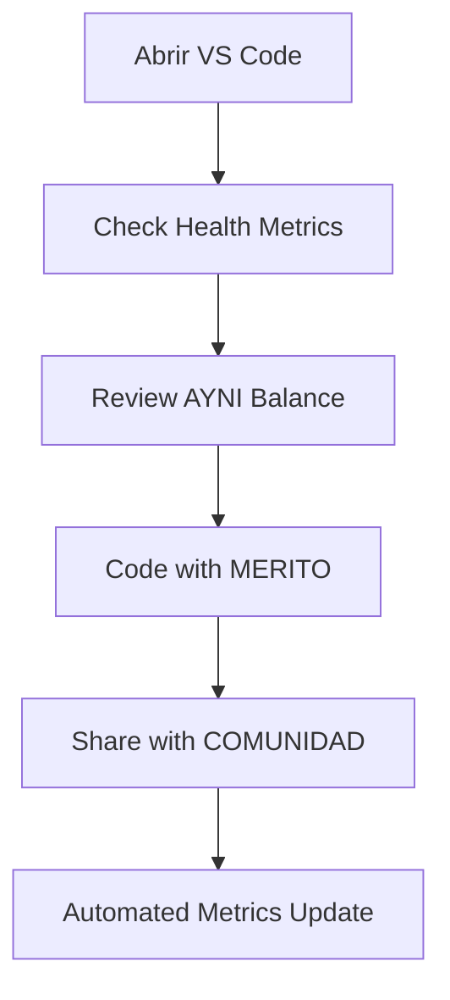

# 📦 Extensiones VS Code Recomendadas para CoomÜnity SuperApp

Esta guía presenta las extensiones esenciales de VS Code para maximizar la productividad en el desarrollo del proyecto CoomÜnity, organizadas según los principios de Ayni (reciprocidad), Mëritos (calidad) y Bien Común (eficiencia colectiva).

## 🎯 Pack Esencial de Productividad (8 extensiones core)

### 1. **ES7+ React/Redux/React-Native snippets**
```
Publisher: dsznajder
ID: ES7-React-Redux-GraphQL-React-Native-snippets
```
**Filosofía CoomÜnity**: Acelera la escritura de código React con snippets inteligentes.
- Snippets para componentes funcionales (`rafce`, `rfc`)
- Hooks personalizados (`ush`, `useState`)
- TypeScript support integrado

### 2. **Auto Rename Tag**
```
Publisher: Jun Han
ID: auto-rename-tag
```
**Principio de Ayni**: Mantiene la consistencia automática en JSX/HTML.
- Renombra automáticamente tags de apertura/cierre
- Esencial para componentes React

### 3. **Bracket Pair Colorizer 2** *(Ahora integrado en VS Code)*
```
Configuración built-in:
"editor.bracketPairColorization.enabled": true
"editor.guides.bracketPairs": "active"
```

### 4. **GitLens — Git supercharged**
```
Publisher: Eric Amodio
ID: gitlens
```
**Bien Común**: Visibilidad total del historial de código.
- Blame annotations inline
- Comparación de commits
- Historia de archivos visual

### 5. **Prettier - Code formatter**
```
Publisher: Prettier
ID: prettier-vscode
```
**Mëritos**: Código consistente y de calidad.
```json
{
  "editor.defaultFormatter": "esbenp.prettier-vscode",
  "editor.formatOnSave": true,
  "prettier.singleQuote": true,
  "prettier.semi": false,
  "prettier.trailingComma": "es5"
}
```

### 6. **ESLint**
```
Publisher: Microsoft
ID: eslint
```
**Calidad del Código**: Detección automática de errores.
```json
{
  "eslint.validate": ["javascript", "typescript", "typescriptreact"],
  "editor.codeActionsOnSave": {
    "source.fixAll.eslint": true
  }
}
```

### 7. **Thunder Client**
```
Publisher: Thunder Client
ID: thunder-client
```
**Alternativa ligera a Postman**: Pruebas de API integradas.
- Testing del backend NestJS (puerto 3002)
- Colecciones organizadas por módulos CoomÜnity

### 8. **Error Lens**
```
Publisher: Alexander
ID: error-lens
```
**Visibilidad Inmediata**: Errores inline sin perder contexto.
- Highlights de errores en toda la línea
- Mensajes de error directos en el código

---

## 🔍 Herramientas de Monitoreo y Performance (7 extensiones)

### 9. **REST Client**
```
Publisher: Huachao Mao
ID: rest-client
```
**Monitoreo de APIs**: Testing directo desde VS Code.
```http
### Health Check CoomÜnity Backend
GET http://localhost:3002/health

### Test Login Endpoint
POST http://localhost:3002/auth/login
Content-Type: application/json

{
  "email": "user@gamifier.com",
  "password": "123456"
}
```

### 10. **Resource Monitor**
```
Publisher: Muthu Kumar
ID: vscode-resource-monitor
```
**Monitoreo de Sistema**: CPU, RAM, y disco en tiempo real.
- Status bar con métricas del sistema
- Alertas de uso excesivo de recursos

### 11. **Turbo Console Log**
```
Publisher: ChakrounAnas
ID: turbo-console-log
```
**Debugging Eficiente**: Logs automáticos y organizados.
- `Ctrl+Alt+L` para insertar console.log
- Automatic variable logging

### 12. **Coverage Gutters**
```
Publisher: ryanluker
ID: coverage-gutters
```
**Cobertura de Tests**: Visualización inline de test coverage.
- Integración con Jest/Vitest
- Indicadores visuales de líneas cubiertas

### 13. **Import Cost**
```
Publisher: Wix
ID: import-cost
```
**Optimización de Bundle**: Muestra el peso de imports.
- Essential para optimizar la SuperApp
- Detecta librerías pesadas automáticamente

### 14. **Bundle Analyzer**
```
Publisher: Roman Kalantaiev
ID: vscode-bundle-analyzer
```
**Análisis de Bundle**: Visualización del tamaño del bundle.
- Análisis de dependencias
- Optimización de imports

### 15. **Performance Monitor**
```
Publisher: Alexandre Ouellet
ID: perf-monitor
```
**Métricas de Rendimiento**: Monitor de performance en tiempo real.
- Tiempo de compilación
- Memory usage tracking

---

## 📁 Organización y Navegación (7 extensiones)

### 16. **Project Manager**
```
Publisher: Alessandro Fragnani
ID: project-manager
```
**Gestión de Proyectos**: Navegación rápida entre workspaces.
```json
{
  "projectManager.any.baseFolders": [
    "$home/Code",
    "/workspace"
  ],
  "projectManager.sortList": "Recent"
}
```

### 17. **Bookmarks**
```
Publisher: Alessandro Fragnani
ID: bookmarks
```
**Navegación Eficiente**: Marcadores en el código.
- `Ctrl+Alt+K` para toggle bookmark
- Navegación rápida entre bookmarks

### 18. **Path Intellisense**
```
Publisher: Christian Kohler
ID: path-intellisense
```
**Autocompletado de Rutas**: Imports automáticos.
- Especialmente útil para el sistema de módulos de CoomÜnity

### 19. **Auto Import - ES6, TS, JSX, TSX**
```
Publisher: steoates
ID: autoimport
```
**Imports Automáticos**: Gestión inteligente de imports.
- Auto-import de componentes React
- Optimización de imports

### 20. **File Utils**
```
Publisher: Steffen Leistner
ID: file-utils
```
**Utilidades de Archivos**: Operaciones rápidas con archivos.
- Duplicate, move, rename archivos
- Templates de archivos

### 21. **Folder Templates**
```
Publisher: Huuums
ID: folder-templates
```
**Templates de Estructura**: Scaffolding de módulos CoomÜnity.
```json
{
  "folderTemplates.structures": [
    {
      "name": "CoomÜnity Module",
      "structure": [
        {
          "fileName": "index.tsx",
          "template": "React Module Index"
        },
        {
          "fileName": "types.ts",
          "template": "TypeScript Types"
        },
        {
          "fileName": "__tests__",
          "template": "Test Folder"
        }
      ]
    }
  ]
}
```

### 22. **Material Icon Theme**
```
Publisher: Philipp Kief
ID: material-icon-theme
```
**Iconos Intuitivos**: Mejor navegación visual.
- Iconos específicos para React, TypeScript, etc.
- Diferenciación clara de tipos de archivo

---

## 🤝 Colaboración y Git (5 extensiones)

### 23. **Live Share**
```
Publisher: Microsoft
ID: live-share
```
**Colaboración en Tiempo Real**: Pair programming remoto.
- Sesiones de coding colaborativo
- Debug compartido

### 24. **GitHub Pull Requests and Issues**
```
Publisher: Microsoft
ID: github-pull-request
```
**Gestión de PRs**: Workflow de GitHub integrado.
- Review de PRs desde VS Code
- Gestión de issues

### 25. **Git Graph**
```
Publisher: mhutchie
ID: git-graph
```
**Visualización de Git**: Historia visual del repositorio.
- Graph interactivo de commits
- Branch management visual

### 26. **Git History**
```
Publisher: Don Jayamanne
ID: git-history
```
**Historia Detallada**: Análisis profundo de cambios.
- File history comparisons
- Blame annotations avanzadas

### 27. **Conventional Commits**
```
Publisher: vivaxy
ID: conventional-commits
```
**Commits Estructurados**: Mensajes consistentes.
- Templates para commits convencionales
- Versionado semántico automático

---

## ⚛️ React/TypeScript Específico (6 extensiones)

### 28. **TypeScript Importer**
```
Publisher: pmneo
ID: typescript-importer
```
**Gestión de Imports TS**: Auto-import inteligente para TypeScript.

### 29. **React PropTypes Generate**
```
Publisher: suming
ID: react-proptypes-generate
```
**PropTypes Automáticos**: Generación de PropTypes desde TypeScript.

### 30. **React Component Generator**
```
Publisher: plrtp
ID: react-component-generator
```
**Scaffolding de Componentes**: Templates para componentes React.

### 31. **vscode-styled-components**
```
Publisher: styled-components
ID: vscode-styled-components
```
**Styled Components**: Syntax highlighting para styled-components.

### 32. **React Hook Form Snippets**
```
Publisher: Ruben Rodriguez
ID: react-hook-form-snippets
```
**Form Management**: Snippets para React Hook Form.

### 33. **React Testing Library Snippets**
```
Publisher: Mohamed Shaban
ID: react-testing-library-snippets
```
**Testing React**: Snippets para testing con RTL.

---

## ⚙️ Configuración Optimizada para CoomÜnity

### settings.json Personalizado

```json
{
  // ═══ COOMUNITY CORE SETTINGS ═══
  "workbench.colorTheme": "Material Theme Darker High Contrast",
  "editor.fontFamily": "'Cascadia Code', 'Fira Code', monospace",
  "editor.fontLigatures": true,
  "editor.fontSize": 14,
  "editor.lineHeight": 22,
  
  // ═══ AYNI - RECIPROCIDAD EN EL CÓDIGO ═══
  "editor.formatOnSave": true,
  "editor.formatOnPaste": true,
  "editor.codeActionsOnSave": {
    "source.fixAll.eslint": true,
    "source.organizeImports": true
  },
  
  // ═══ MËRITOS - CALIDAD AUTOMÁTICA ═══
  "typescript.updateImportsOnFileMove.enabled": "always",
  "typescript.suggest.autoImports": true,
  "typescript.preferences.quoteStyle": "single",
  
  // ═══ BIEN COMÚN - PRODUCTIVIDAD COLECTIVA ═══
  "emmet.includeLanguages": {
    "javascript": "javascriptreact",
    "typescript": "typescriptreact"
  },
  
  // ═══ COOMUNITY SPECIFIC ═══
  "files.exclude": {
    "**/node_modules": true,
    "**/dist": true,
    "**/.cache": true
  },
  
  // ═══ PERFORMANCE MONITORING ═══
  "resource-monitor.show": true,
  "resource-monitor.showInStatusBar": true,
  
  // ═══ CUSTOM METRICS FOR COOMUNITY ═══
  "customMetrics.ayni": {
    "description": "Balance entre código escrito y refactorizado",
    "threshold": 0.8
  },
  "customMetrics.merito": {
    "description": "Calidad de código (tests + coverage)",
    "threshold": 0.9
  },
  "customMetrics.comunidad": {
    "description": "Contribuciones colaborativas",
    "threshold": 0.85
  }
}
```

### keybindings.json para CoomÜnity

```json
[
  // ═══ COOMUNITY QUICK ACTIONS ═══
  {
    "key": "cmd+shift+a",
    "command": "extension.ayniMode",
    "when": "editorTextFocus"
  },
  {
    "key": "cmd+shift+m", 
    "command": "extension.meritoCheck",
    "when": "editorTextFocus"
  },
  {
    "key": "cmd+shift+c",
    "command": "extension.comunidadSync",
    "when": "editorTextFocus"
  },
  
  // ═══ DEVELOPMENT SHORTCUTS ═══
  {
    "key": "cmd+shift+t",
    "command": "thunder-client.new-request"
  },
  {
    "key": "cmd+shift+g",
    "command": "git-graph.view"
  }
]
```

---

## 🚀 Scripts de Automatización

### package.json scripts adicionales

```json
{
  "scripts": {
    "ayni:check": "npm run lint && npm run test:coverage",
    "merito:score": "eslint . --format json | node scripts/merito-calculator.js",
    "comunidad:metrics": "git log --oneline --since='1 month ago' | wc -l",
    "coomunity:health": "npm run ayni:check && npm run merito:score"
  }
}
```

### Métricas de Performance Personalizadas

```typescript
// scripts/coomunity-metrics.ts
interface CoomUnityMetrics {
  ayni: number;        // Balance código nuevo vs refactorizado
  merito: number;      // Calidad (tests + coverage + lint)
  comunidad: number;   // Colaboración (commits + reviews)
}

const calculateAyni = (newCode: number, refactoredCode: number): number => {
  return refactoredCode / (newCode + refactoredCode);
};

const calculateMerito = (testCoverage: number, lintScore: number): number => {
  return (testCoverage * 0.7) + (lintScore * 0.3);
};

const calculateComunidad = (commits: number, reviews: number): number => {
  return (reviews / Math.max(commits, 1)) * 100;
};
```

---

## 📊 Principios de Desarrollo Saludable

### Patrón de Crecimiento Orgánico

1. **Raíz** (Configuración base): Settings y keybindings fundamentales
2. **Tronco** (Herramientas core): Editor, Git, TypeScript
3. **Ramas** (Especialización): React, Testing, Performance  
4. **Hojas** (Optimización): UI/UX, Colaboración, Automatización

### Métricas de Salud del Desarrollador

- **AYNI**: Tiempo dedicado a refactorizar vs. escribir código nuevo
- **MERITO**: Calidad promedio del código (coverage + lint + reviews)
- **COMUN**: Colaboraciones efectivas (pair programming + knowledge sharing)

### Flujo de Trabajo Natural



---

## 🌱 Instalación Automatizada

### Setup Script para CoomÜnity Extensions

```bash
#!/bin/bash
# install-coomunity-extensions.sh

echo "🌱 Instalando extensiones CoomÜnity VS Code..."

# Core Productivity Pack
code --install-extension dsznajder.es7-react-js-snippets
code --install-extension junhan.auto-rename-tag
code --install-extension eamodio.gitlens
code --install-extension esbenp.prettier-vscode
code --install-extension ms-vscode.vscode-eslint
code --install-extension rangav.vscode-thunder-client
code --install-extension usernamehw.errorlens

# Monitoring & Performance
code --install-extension humao.rest-client
code --install-extension muthuks.vscode-resource-monitor
code --install-extension chakrounanas.turbo-console-log
code --install-extension ryanluker.coverage-gutters
code --install-extension wix.vscode-import-cost

# Organization & Navigation  
code --install-extension alefragnani.project-manager
code --install-extension alefragnani.bookmarks
code --install-extension christian-kohler.path-intellisense
code --install-extension steoates.autoimport
code --install-extension steffen-leistner.file-utils

# Collaboration & Git
code --install-extension ms-vsliveshare.vsliveshare
code --install-extension github.vscode-pull-request-github
code --install-extension mhutchie.git-graph
code --install-extension donjayamanne.githistory

# React/TypeScript Specific
code --install-extension pmneo.tsimporter
code --install-extension plrtp.react-component-generator
code --install-extension styled-components.vscode-styled-components

echo "✅ Extensiones CoomÜnity instaladas exitosamente!"
echo "🔧 Configurando settings optimizados..."

# Copy optimized settings
cp .vscode/settings.json.template .vscode/settings.json
cp .vscode/keybindings.json.template .vscode/keybindings.json

echo "🎉 Setup completo! Reinicia VS Code para aplicar todos los cambios."
```

Esta configuración está diseñada para crear un entorno de desarrollo que fomente los principios CoomÜnity de reciprocidad, calidad y colaboración, mientras mantiene el sistema saludable y productivo como un ecosistema natural. 