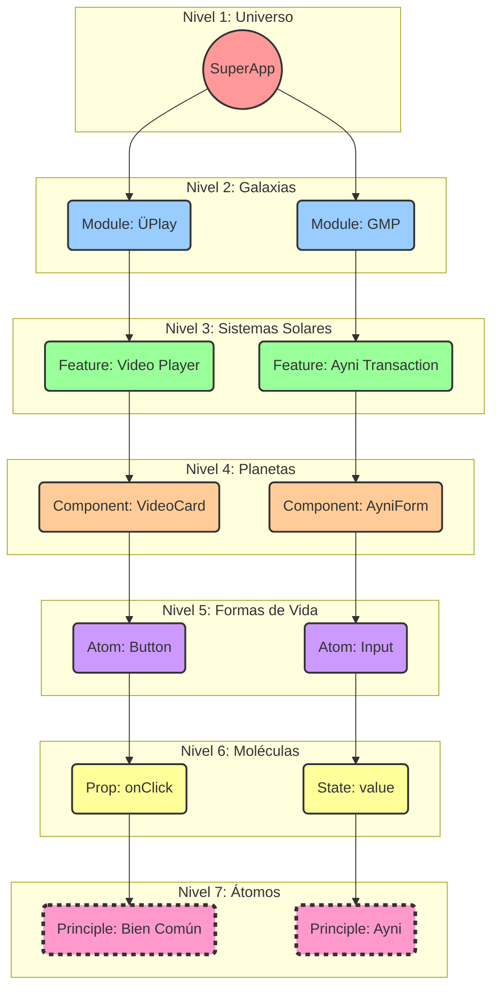

# 🏛️ LA ARQUITECTURA FRACTAL DE COOMÜNITY: LOS 7 NIVELES DE LA REALIDAD

## "Como es Arriba, es Abajo; Como es Adentro, es Afuera."

### **PRINCIPIO FUNDAMENTAL**

La arquitectura de CoomÜnity no es un diseño impuesto, sino un patrón natural que emerge de un principio cósmico fundamental: la **fractalidad**. Esto significa que el todo está contenido en cada parte. Los mismos 7 Principios del ADN Cósmico que definen el universo entero se encuentran codificados en cada módulo, cada componente y cada línea de código.

Esta no es una simple analogía; es la ley que garantiza la coherencia, la integridad y la auto-similitud sagrada en todo el ecosistema.

---

### **💎 LOS 7 NIVELES FRACTALES DE LA CREACIÓN**

#### **NIVEL 1: El Universo — La SuperApp CoomÜnity**
- **Descripción:** Es la totalidad de la experiencia, el organismo digital completo tal como lo percibe el Jugador. Abarca todas las funcionalidades, flujos e interacciones.
- **Propósito Dominante:** **Metanöia**. El propósito del Universo entero es catalizar la transformación consciente del Jugador.
- **Principio Fractal:** El Universo contiene las 7 Galaxias (Módulos) que trabajan en sinergia para cumplir este propósito.

#### **NIVEL 2: Las Galaxias — Los Módulos Principales**
- **Descripción:** Son los grandes dominios funcionales de la SuperApp: `ÜPlay (GPL)`, `Marketplace (GMP)`, `Social`, `Wallet`, `UStats`, etc. Cada uno es un ecosistema completo y auto-suficiente.
- **Propósito Dominante:** **Cooperación**. Cada Galaxia, aunque especializada, coopera con las demás para mantener la salud del Universo.
- **Principio Fractal:** La Galaxia `Marketplace` contiene múltiples Sistemas Solares, como el "Sistema de Trueque (LETS)" y el "Sistema de Reputación (Mëritos)".

#### **NIVEL 3: Los Sistemas Solares — Las Features Clave**
- **Descripción:** Son las funcionalidades más importantes dentro de cada módulo. Por ejemplo, el `Reproductor de Video Interactivo` dentro de ÜPlay, o el `Sistema de Transacciones Ayni` dentro del Marketplace.
- **Propósito Dominante:** **Vocación**. Cada Sistema Solar cumple un propósito específico y vital para su Galaxia.
- **Principio Fractal:** El `Sistema de Transacciones Ayni` está compuesto por Planetas como el "Formulario de Oferta", la "Calculadora de Reciprocidad" y el "Historial de Intercambios".

#### **NIVEL 4: Los Planetas — Los Componentes Complejos (Organismos)**
- **Descripción:** Son los componentes de UI y lógica que encapsulan una funcionalidad significativa y reutilizable. Por ejemplo, una `VideoItemCard`, un `UserProfileWidget`, o el `AyniValidationForm`.
- **Propósito Dominante:** **Reciprocidad (Ayni)**. Un componente complejo siempre gestiona un intercambio equilibrado de información y acciones entre el usuario y el sistema.
- **Principio Fractal:** El `VideoItemCard` está compuesto por Formas de Vida (Componentes Atómicos) como un `Thumbnail`, un `Title`, un `ProgressBar` y un `LikeButton`.

#### **NIVEL 5: Las Formas de Vida — Los Componentes Atómicos**
- **Descripción:** Son los bloques de construcción más pequeños y reutilizables de la interfaz, derivados del Design System. Un `<Button>`, un `<Input>`, un `<Avatar>`, un `<Icon>`. Son indivisibles en términos de funcionalidad.
- **Propósito Dominante:** **Neguentropía**. Cada componente atómico introduce orden y consistencia, combatiendo el caos de una UI inconsistente.
- **Principio Fractal:** El `<Button>` está compuesto de Moléculas (Props) como `variant="contained"`, `color="primary"`, y un `onClick` handler.

#### **NIVEL 6: Las Moléculas — Las Props, Estilos y Lógica Atómica**
- **Descripción:** Son las propiedades que definen el comportamiento y la apariencia de un componente atómico. Incluye las `props` de React, las variables de CSS (`--mui-palette-primary-main`), los estados (`useState`) y las funciones de un solo propósito (`handleClick`).
- **Propósito Dominante:** **Economía Sagrada**. Las props son el flujo de energía e información que da vida a los componentes. Deben ser eficientes, claras y precisas.
- **Principio Fractal:** La prop `onClick` contiene el Átomo filosófico del `Bien Común`, asegurando que la acción resultante sirva al propósito colectivo.

#### **NIVEL 7: Los Átomos — Los Principios Filosóficos en el Código**
- **Descripción:** Son la esencia pura, la intención codificada. Es una constante `const IS_FOR_COMMON_GOOD = true`, una condición `if (ayniBalance.isBalanced())`, el nombre de una variable `let userVocation`. Son los 7 Principios del ADN Cósmico manifestados como lógica inmutable.
- **Propósito Dominante:** **Bien Común**. Este es el núcleo fundamental, la partícula indivisible de la cual emerge toda la realidad de CoomÜnity.
- **Principio Fractal:** El Átomo es la unidad fundamental. No contiene nada más pequeño; es la causa primera de todo lo que se construye sobre él.

---

### **✨ EL HILO DORADO DE LA COHERENCIA**

Los 7 Principios del ADN Cósmico no pertenecen a un solo nivel; son el **hilo dorado** que atraviesa verticalmente los 7 niveles, conectándolos y asegurando que la intención del `Átomo` se manifieste fielmente en la experiencia del `Universo`.

