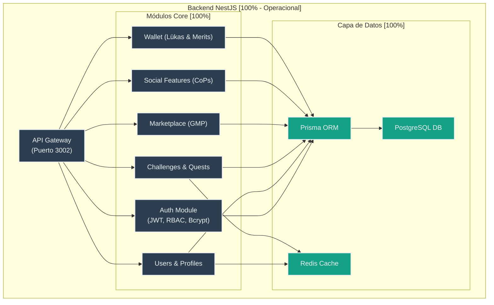

```mermaid
graph TD;
    classDef done fill:#2c3e50,stroke:#ecf0f1,stroke-width:2px,color:#ecf0f1;
    classDef db fill:#16a085,stroke:#ecf0f1,stroke-width:2px,color:#ecf0f1;

    subgraph "Backend NestJS [100% - Operacional]";
        direction LR;
      
        API_Gateway["API Gateway<br/>(Puerto 3002)"]:::done;
      
        subgraph "Módulos Core [100%]";
            Auth["Auth Module<br/>(JWT, RBAC, Bcrypt)"]:::done;
            Users["Users & Profiles"]:::done;
            Challenges["Challenges & Quests"]:::done;
            Marketplace["Marketplace (GMP)"]:::done;
            Social["Social Features (CoPs)"]:::done;
            Wallet["Wallet (Lükas & Merits)"]:::done;
        end

        subgraph "Capa de Datos [100%]";
            Prisma["Prisma ORM"]:::db;
            PostgreSQL["PostgreSQL DB"]:::db;
            Redis["Redis Cache"]:::db;
        end

        API_Gateway --> Auth;
        API_Gateway --> Users;
        API_Gateway --> Challenges;
        API_Gateway --> Marketplace;
        API_Gateway --> Social;
        API_Gateway --> Wallet;

        Auth --> Prisma;
        Users --> Prisma;
        Challenges --> Prisma;
        Marketplace --> Prisma;
        Social --> Prisma;
        Wallet --> Prisma;
      
        Users --> Redis;
        Challenges --> Redis;
      
        Prisma --> PostgreSQL;
    end
```
