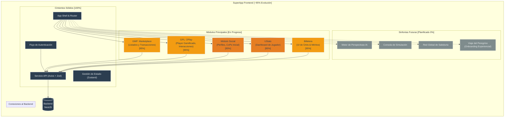

```mermaid
graph TD;
    classDef done fill:#2c3e50,stroke:#ecf0f1,stroke-width:2px,color:#ecf0f1;
    classDef progress95 fill:#f39c12,stroke:#ecf0f1,stroke-width:2px,color:#2c3e50;
    classDef progress85 fill:#e67e22,stroke:#ecf0f1,stroke-width:2px,color:#2c3e50;
    classDef todo fill:#7f8c8d,stroke:#bdc3c7,stroke-width:2px,stroke-dasharray: 3 3,color:#ecf0f1;

    subgraph "SuperApp Frontend [~95% Evolución]";
        direction TB;
        
        subgraph "Cimientos Sólidos [100%]";
            CoreShell["App Shell & Router"]:::done;
            AuthFlow["Flujo de Autenticación"]:::done;
            ApiService["Servicio API (Axios + Zod)"]:::done;
            StateManagement["Gestión de Estado (Zustand)"]:::done;
        end

        subgraph "Módulos Principales [En Progreso]";
            GMP["GMP: Marketplace<br/>(Listados y Transacciones)<br/>[95%]"]:::progress95;
            GPL["GPL: ÜPlay<br/>(Player Gamificado, Interacciones)<br/>[95%]"]:::progress95;
            Social["Módulo Social<br/>(Perfiles, CoPs Inicial)<br/>[85%]"]:::progress85;
            UStats["UStats<br/>(Dashboard de Jugador)<br/>[85%]"]:::progress85;
            Wallet["Billetera<br/>(UI de Ünits & Méritos)<br/>[95%]"]:::progress95;
        end

        subgraph "Sinfonías Futuras [Planificado 0%]";
            Insights["Motor de Perspectivas IA"]:::todo;
            Sims["Consola de Simulación"]:::todo;
            KnowledgeNet["Red Global de Sabiduría"]:::todo;
            Onboarding["Viaje del Peregrino<br/>(Onboarding Experiencial)"]:::todo;
        end
        
        Backend[("Backend<br/>NestJS")]:::done
        
        AuthFlow --> ApiService --> Backend;
        CoreShell --> GMP & GPL & Social & UStats & Wallet;
        
        subgraph Conexiones al Backend
            direction LR
            GMP --> ApiService;
            GPL --> ApiService;
            Social --> ApiService;
            UStats --> ApiService;
            Wallet --> ApiService;
        end
        
        CoreShell -.-> Insights & Sims & KnowledgeNet & Onboarding;
    end
``` 
