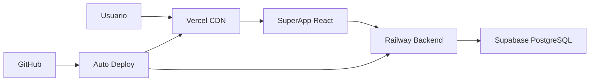

# 🚀 CoomÜnity Deployment Roadmap - 100% Gratuito

## 🎯 **ESTRATEGIA ELEGIDA: RAILWAY + VERCEL + SUPABASE**

### **📊 CONFIGURACIÓN ÓPTIMA CONFIRMADA**

| Componente | Servicio | Plan | Costo | Beneficios Clave |
|------------|----------|------|-------|------------------|
| **Backend** | Railway | $5 créditos | $0/mes inicial | No se duerme, 512MB RAM, Railpack |
| **Frontend** | Vercel | Free Forever | $0/mes | CDN global, 100GB bandwidth |
| **Database** | Supabase | Free Tier | $0/mes | 500MB, Auth incluida, 99.9% uptime |

**💰 COSTO TOTAL: $0/mes durante 1-2 meses**

## 📋 **ORDEN DE DEPLOYMENT RECOMENDADO**

### **🥇 PRIORIDAD 1: BASE DE DATOS (Supabase)**
```bash
⏱️ Tiempo estimado: 10-15 minutos
🔧 Complejidad: Baja
📋 Dependencias: Ninguna
```

**Pasos:**
1. Crear proyecto Supabase
2. Configurar password segura
3. Obtener connection string
4. Migrar schema con Prisma
5. Verificar tablas creadas

### **🥈 PRIORIDAD 2: BACKEND (Railway)**
```bash
⏱️ Tiempo estimado: 15-20 minutos
🔧 Complejidad: Media
📋 Dependencias: Supabase connection string
```

**Pasos:**
1. Conectar GitHub a Railway
2. Configurar build settings
3. Añadir variables de entorno
4. Deploy y verificar health check
5. Obtener dominio público

### **🥉 PRIORIDAD 3: FRONTEND (Vercel)**
```bash
⏱️ Tiempo estimado: 10-15 minutos
🔧 Complejidad: Baja
📋 Dependencias: Railway domain URL
```

**Pasos:**
1. Importar repo en Vercel
2. Configurar build settings
3. Añadir variables de entorno
4. Deploy y verificar conectividad
5. Testing end-to-end

## 🔗 **FLUJO DE CONEXIONES**



## 📈 **MÉTRICAS DE ÉXITO**

### **✅ Criterios de Aceptación:**

1. **Supabase:**
   - [ ] Base de datos accesible
   - [ ] Tablas CoomÜnity creadas
   - [ ] Conexión desde Railway OK

2. **Railway:**
   - [ ] Build exitoso sin errores
   - [ ] Health check responde 200
   - [ ] Logs sin errores críticos
   - [ ] Conexión a Supabase OK

3. **Vercel:**
   - [ ] Build de SuperApp exitoso
   - [ ] Dominio accesible
   - [ ] Conexión a Railway API OK
   - [ ] Routing SPA funcionando

4. **Integración E2E:**
   - [ ] Login/logout funciona
   - [ ] API calls exitosas
   - [ ] UI renderiza correctamente
   - [ ] Performance aceptable

## 🚨 **PLAN DE CONTINGENCIA**

### **Si Railway se queda sin créditos:**
1. **Opción A:** Upgrade a Railway Hobby ($5/mes)
2. **Opción B:** Migrar a Render Free (con limitaciones)
3. **Opción C:** Usar Heroku Student Pack (si aplica)

### **Si Supabase alcanza límites:**
1. **Optimizar queries** y reducir calls
2. **Implementar caching** en Railway
3. **Upgrade a Supabase Pro** ($25/mes)

### **Si Vercel alcanza límites:**
1. **Optimizar assets** (images, bundles)
2. **Implementar caching** headers
3. **Usar Netlify** como alternativa

## 📅 **TIMELINE ESTIMADO**

```bash
🕐 Hora 0: Inicio
├── 🕐 +15min: Supabase configurado
├── 🕐 +35min: Railway deployado
├── 🕐 +50min: Vercel deployado
└── 🕐 +60min: Testing E2E completo

⏱️ TOTAL: ~1 hora para deployment completo
```

## 🎯 **PRÓXIMOS PASOS INMEDIATOS**

1. **Crear proyecto Supabase** → [Guía detallada](./SUPABASE_SETUP_GUIDE.md)
2. **Configurar Railway** → [Guía detallada](./RAILWAY_DEPLOYMENT_GUIDE.md)
3. **Deploy en Vercel** → [Guía detallada](./VERCEL_DEPLOYMENT_GUIDE.md)

**¿Listo para empezar? 🚀** 
