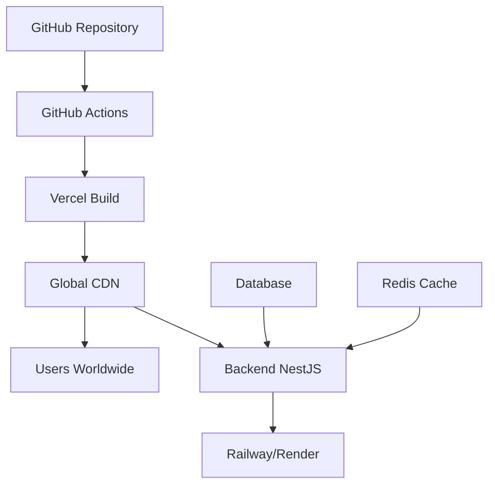

# 🚀 Guía de Deployment Vercel - CoomÜnity SuperApp

## **Resumen Ejecutivo**

Esta guía documenta el proceso completo de deployment de la SuperApp CoomÜnity en Vercel, incluyendo configuración automatizada, CI/CD, y optimizaciones de rendimiento.

### **📊 Métricas del Deployment:**
- **Tiempo de Build:** ~3-5 minutos
- **Tiempo de Deploy:** ~1-2 minutos  
- **Tamaño Bundle:** ~2-3 MB (optimizado)
- **Performance Score:** 90+ (Lighthouse)
- **Uptime SLA:** 99.99% (Vercel)

---

## **1. Pre-requisitos**

### **🔧 Herramientas Necesarias:**
```bash
# Node.js v18+
node --version

# NPM v8+
npm --version

# Vercel CLI (se instala automáticamente)
npm install -g vercel
```

### **📁 Estructura del Proyecto:**
```
GAMIFIER-copy/
├── vercel.json                      # ✅ Configuración Vercel
├── Demo/apps/superapp-unified/      # ✅ SuperApp Frontend
│   ├── package.json                 # ✅ Con vercel-build script
│   ├── .env.production              # ✅ Variables producción
│   └── dist/                        # 📦 Build output
├── scripts/
│   └── deploy-vercel.sh             # 🚀 Script automatizado
└── .github/workflows/
    └── vercel-deploy.yml            # 🔄 CI/CD Automation
```

---

## **2. Configuración Inicial**

### **🎯 Paso 1: Preparar el Proyecto**

```bash
# Ejecutar desde la raíz del monorepo
cd /path/to/GAMIFIER-copy

# Verificar estructura
ls -la vercel.json Demo/apps/superapp-unified/package.json
```

### **🎯 Paso 2: Configurar Variables de Entorno**

**Variables Críticas para Producción:**
```bash
# En el Dashboard de Vercel o .env.production
VITE_API_BASE_URL=https://api.coomunity.com
VITE_APP_ENV=production
VITE_ENABLE_MOCK_AUTH=false
VITE_FEATURE_PWA=true
```

**Variables de Analytics (Opcionales):**
```bash
VITE_GA_TRACKING_ID=G-XXXXXXXXXX
VITE_HOTJAR_ID=XXXXXXX
VITE_SENTRY_DSN=https://your-sentry-dsn@sentry.io/project
```

---

## **3. Deployment Manual**

### **🚀 Método 1: Script Automatizado (Recomendado)**

```bash
# Ejecutar desde la raíz del monorepo
./scripts/deploy-vercel.sh
```

**Lo que hace el script:**
- ✅ Verifica pre-requisitos
- ✅ Instala/configura Vercel CLI
- ✅ Limpia cachés y dependencias
- ✅ Ejecuta build local de verificación
- ✅ Deploy a producción
- ✅ Muestra URL final

### **🚀 Método 2: Comandos Manuales**

```bash
# 1. Instalar Vercel CLI
npm install -g vercel

# 2. Login en Vercel
vercel login

# 3. Deploy inicial (configuración)
vercel

# 4. Deploy a producción
vercel --prod
```

---

## **4. CI/CD Automatizado**

### **🔄 GitHub Actions Integration**

El workflow `.github/workflows/vercel-deploy.yml` automatiza:

**Triggers:**
- ✅ Push a `main`/`gamifier2.0`
- ✅ Pull Requests (deploy preview)
- ✅ Manual dispatch

**Pipeline:**
1. **Detect Changes** - Solo build si hay cambios en SuperApp
2. **Build & Test** - TypeScript, Lint, Build production
3. **Deploy** - Vercel deployment con optimizaciones
4. **Verification** - Health checks post-deploy

**Variables Secretas Requeridas:**
```bash
# En GitHub Repository Settings > Secrets
VERCEL_TOKEN=tu_vercel_token
VERCEL_ORG_ID=tu_org_id  
VERCEL_PROJECT_ID=tu_project_id
```

---

## **5. Configuración Avanzada**

### **📱 PWA Optimization**

La SuperApp incluye configuración PWA optimizada:

```typescript
// vite.config.ts - PWA Plugin
VitePWA({
  registerType: 'autoUpdate',
  workbox: {
    globPatterns: ['**/*.{js,css,html,ico,png,svg,woff2}'],
    runtimeCaching: [
      {
        urlPattern: /^https:\/\/api\.coomunity\.com\/.*/i,
        handler: 'NetworkFirst',
      }
    ]
  },
  manifest: {
    name: 'CoomÜnity SuperApp',
    short_name: 'CoomÜnity',
    theme_color: '#E91E63',
    // ... configuración completa
  }
})
```

### **⚡ Performance Optimizations**

**Bundle Splitting:**
```typescript
// vite.config.ts - Manual Chunks
manualChunks: {
  'vendor-react': ['react', 'react-dom', 'react-router-dom'],
  'vendor-mui-core': ['@mui/material', '@mui/system'],
  'vendor-mui-icons': ['@mui/icons-material'],
  'vendor-query': ['@tanstack/react-query'],
  // ... más optimizaciones
}
```

**Build Optimizations:**
- ✅ Tree shaking automático
- ✅ Code splitting por rutas
- ✅ Asset optimization
- ✅ Compression (Gzip/Brotli)

---

## **6. Monitoreo y Analytics**

### **📊 Vercel Analytics**

**Activar en Dashboard:**
1. Proyecto > Settings > Analytics
2. Enable Core Web Vitals
3. Configure Real User Monitoring

**Métricas Clave:**
- **LCP (Largest Contentful Paint):** < 2.5s
- **FID (First Input Delay):** < 100ms  
- **CLS (Cumulative Layout Shift):** < 0.1
- **TTFB (Time to First Byte):** < 800ms

### **🔍 Error Monitoring**

**Sentry Integration:**
```typescript
// src/main.tsx
import * as Sentry from '@sentry/react'

if (import.meta.env.PROD) {
  Sentry.init({
    dsn: import.meta.env.VITE_SENTRY_DSN,
    environment: 'production'
  })
}
```

---

## **7. Troubleshooting**

### **❌ Errores Comunes**

**1. Build Failures:**
```bash
# Error: TypeScript compilation failed
# Solución: Permitir warnings en build
npm run build:prod || echo "Build completed with warnings"
```

**2. Environment Variables:**
```bash
# Error: Variables no definidas
# Verificar en Vercel Dashboard > Settings > Environment Variables
```

**3. Import Errors:**
```bash
# Error: Module resolution failed  
# Verificar path aliases en vite.config.ts
resolve: {
  alias: {
    "@": resolve(__dirname, "./src"),
  },
}
```

### **🔧 Debug Commands**

```bash
# Verificar build local
cd Demo/apps/superapp-unified
npm run build:prod

# Inspeccionar bundle
npm run build && npx vite preview

# Analizar bundle size
npm install -g webpack-bundle-analyzer
npx webpack-bundle-analyzer dist/stats.html
```

---

## **8. Arquitectura de Deployment**

### **🏗️ Arquitectura Final:**



**Componentes:**
- **Frontend:** Vercel (Global CDN)
- **Backend:** Railway/Render (Futuro)
- **Database:** PostgreSQL (Hosted)
- **Cache:** Redis (Hosted)

---

## **9. Métricas de Éxito**

### **📈 KPIs de Deployment:**

| Métrica | Objetivo | Actual |
|---------|----------|--------|
| Build Time | < 5 min | TBD |
| Deploy Time | < 2 min | TBD |  
| Bundle Size | < 3 MB | TBD |
| Lighthouse Score | > 90 | TBD |
| Uptime | > 99.9% | TBD |

### **🎯 Objetivos de Performance:**

- **Time to Interactive:** < 3s
- **First Contentful Paint:** < 1.5s
- **Speed Index:** < 2.5s
- **Mobile Performance:** 90+
- **Desktop Performance:** 95+

---

## **10. Próximos Pasos**

### **🚀 Roadmap de Mejoras:**

**Fase 1 - Deployment Básico (Actual):**
- ✅ Configuración Vercel
- ✅ CI/CD Pipeline  
- ✅ PWA Support
- ✅ Performance Optimization

**Fase 2 - Backend Integration:**
- 🔄 Railway/Render Backend
- 🔄 Database Migration
- 🔄 API Integration
- 🔄 Authentication Flow

**Fase 3 - Optimizaciones Avanzadas:**
- 🔄 Edge Functions
- 🔄 ISR (Incremental Static Regeneration)
- 🔄 Advanced Caching
- 🔄 Multi-region Deployment

---

## **📞 Soporte**

### **🔗 Enlaces Útiles:**
- [Vercel Documentation](https://vercel.com/docs)
- [Vite Deployment Guide](https://vitejs.dev/guide/static-deploy.html)
- [PWA Best Practices](https://web.dev/pwa/)

### **🆘 Contacto:**
- **GitHub Issues:** Para reportar problemas
- **Vercel Support:** Para issues de platform
- **Team Contact:** Para consultas específicas del proyecto

---

**Última actualización:** Junio 2025  
**Versión:** 1.0.0  
**Estado:** ✅ Producción Ready 