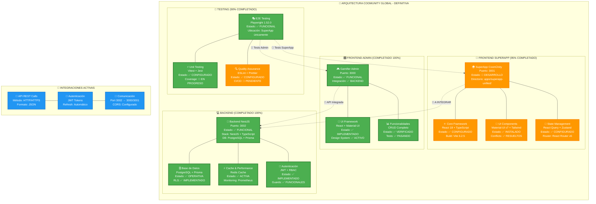

# 🏗️ Documentación Arquitectura Definitiva - CoomÜnity Global

**Versión:** v2.0 - FINAL Y DEFINITIVA  
**Fecha:** 2025-01-19  
**Estado del Proyecto:** Backend 100% + Admin 100% + SuperApp 95%

---

## 📊 Diagrama Arquitectural Definitivo



---

## 🎯 Estado Actual del Proyecto

### ✅ **COMPONENTES COMPLETADOS (100%)**

#### 💻 **Backend NestJS Compartido**
- **Puerto:** 3002 (DEFINITIVO)
- **Stack:** NestJS + TypeScript + PostgreSQL + Prisma + Redis
- **Estado:** ✅ COMPLETAMENTE FUNCIONAL
- **Funcionalidades:**
  - 🔐 Autenticación JWT con RBAC
  - 📊 15+ módulos implementados
  - 🗄️ Base de datos PostgreSQL con Prisma ORM
  - ⚡ Cache Redis para performance
  - 📈 Monitoring con Prometheus + Grafana
  - 🛡️ Seguridad implementada (Guards, Pipes, Interceptors)

#### 🎛️ **Frontend Gamifier Admin**
- **Puerto:** 3000 (DEFINITIVO)
- **Stack:** React + TypeScript + Material-UI
- **Estado:** ✅ COMPLETAMENTE FUNCIONAL E INTEGRADO
- **Funcionalidades:**
  - 👥 Gestión completa de usuarios y roles
  - 🎥 Administración de contenido (videos, subtítulos, preguntas)
  - 📊 Analytics y reportes
  - 🔒 Sistema de permisos granular
  - 🧪 Tests E2E implementados y verificados

### 🔄 **COMPONENTES EN DESARROLLO (95%)**

#### 📱 **Frontend SuperApp CoomÜnity**
- **Puerto:** 3001 (DEFINITIVO)
- **Directorio:** `apps/superapp-unified/`
- **Stack:** React 18 + TypeScript + Material-UI v7 + Tailwind CSS
- **Estado:** 🔄 95% COMPLETADO - INTEGRACIÓN PENDIENTE

**✅ Completado:**
- ⚛️ Framework React 18 + TypeScript configurado
- 🎨 Material-UI v7 + Tailwind CSS instalado (conflictos resueltos)
- 🔗 React Query + Zustand para estado
- 🧭 React Router v6 configurado
- 📝 React Hook Form + Zod para formularios
- 🎭 Playwright 1.52.0 configurado para testing

**🔄 Pendiente:**
- 🔌 Migración de servicios temporales (Supabase → Backend NestJS)
- 🔑 Implementación de autenticación JWT del backend
- 🗑️ Limpieza de dependencias temporales
- 🧪 Tests E2E completos contra backend real

### 🧪 **Testing Infrastructure (90%)**

#### ✅ **Configurado y Funcional:**
- **Playwright 1.52.0:** E2E testing configurado (SuperApp únicamente)
- **Vitest:** Unit testing configurado
- **ESLint + Prettier:** Code quality configurado

#### 🔄 **En Progreso:**
- Cobertura de tests completa
- CI/CD pipeline configuración

---

## 🚨 **Componentes Eliminados/Deprecated**

### ❌ **NO UTILIZAR (Eran Temporales):**
- **Supabase Integration:** Era mock para desarrollo independiente
- **Express Backend Mock:** Era temporal en puerto 3000 (conflicto)
- **@supabase/supabase-js:** Dependencia a eliminar
- **Backend Auxiliar Express:** No existe en arquitectura final

---

## 🎯 **Plan de Integración - Próximos Pasos**

### 🔥 **PRIORIDAD ALTA (Esta Semana)**

#### 1. **Migración de Servicios API**
```typescript
// ANTES (temporal - A ELIMINAR):
import { supabase } from '@/lib/supabase';

// DESPUÉS (real - A IMPLEMENTAR):
import { nestJSApiService } from '@/lib/nestjs-api-service';
```

#### 2. **Configuración de Variables de Entorno**
```bash
# ANTES (temporal):
VITE_SUPABASE_URL=...
VITE_API_BASE_URL=http://localhost:3333  # Express temporal

# DESPUÉS (definitivo):
VITE_API_BASE_URL=http://localhost:1111  # Backend NestJS real
VITE_JWT_SECRET_KEY=...
```

#### 3. **Autenticación JWT**
- Implementar login/logout contra Backend NestJS
- Configurar interceptors para tokens automáticos
- Manejar refresh tokens

### 🔄 **PRIORIDAD MEDIA (1-2 Semanas)**

#### 4. **Migración de Datos**
- Usuarios y perfiles
- Sistema de wallet y gamificación
- Contenido multimedia
- Analytics y métricas

#### 5. **Limpieza de Código**
- Remover referencias a Supabase
- Eliminar dependencias temporales
- Actualizar tipos TypeScript

### 💡 **PRIORIDAD BAJA (Final)**

#### 6. **Testing Completo**
- E2E tests contra Backend NestJS real
- Cobertura de código al 90%+
- Performance testing

#### 7. **Deployment**
- Configurar producción
- CI/CD pipeline
- Documentación final

---

## 📋 **Comandos de Desarrollo Definitivos**

### 🚀 **Iniciar Servicios:**
```bash
# Backend NestJS (fuera de este workspace)
cd backend/ && npm run dev  # Puerto 3002

# SuperApp Frontend (desarrollo actual)
cd apps/superapp-unified/ && npm run dev  # Puerto 3001

# Gamifier Admin (fuera de este workspace)
cd admin-frontend/ && npm run dev  # Puerto 3000
```

### 🧪 **Testing:**
```bash
# E2E Tests con Playwright
cd apps/superapp-unified/ && npm run test:e2e

# Unit Tests con Vitest
cd apps/superapp-unified/ && npm run test:unit

# Verificar instalaciones de Playwright (debe ser UNA)
find . -name "@playwright" -type d
```

### 🔍 **Verificación de Estado:**
```bash
# Pre-flight check obligatorio
ps aux | grep -E "(node|tsx|npm)" | grep -v grep
cat apps/superapp-unified/.env
curl http://localhost:1111/health -v
curl http://localhost:2222 -I
```

---

## 📊 **Métricas del Proyecto**

| **Componente** | **Estado** | **Progreso** | **Tests** | **Integración** |
|----------------|------------|--------------|-----------|-----------------|
| Backend NestJS | ✅ Funcional | 100% | ✅ Pasando | ✅ Completa |
| Admin Frontend | ✅ Funcional | 100% | ✅ Pasando | ✅ Completa |
| SuperApp Frontend | 🔄 Desarrollo | 95% | 🔄 Parcial | 🔄 Pendiente |
| Testing Infrastructure | 🔄 Configurado | 90% | ✅ Configurado | 🔄 Parcial |

---

## 🔄 **Versionado de Diagramas**

### **Historial de Versiones:**
- **v1.0** (2024-12) - Arquitectura inicial con componentes dispersos
- **v1.5** (2025-01) - Backend NestJS completado, Admin integrado
- **v2.0** (2025-01-19) - **ARQUITECTURA DEFINITIVA** documentada

### **Control de Cambios:**
- Cada actualización arquitectural debe reflejarse en este diagrama
- Versioning semántico: Major.Minor.Patch
- Fecha de última actualización siempre visible
- Estado de componentes actualizado en tiempo real

---

## 📚 **Referencias y Enlaces**

### **Archivos Clave:**
- `ARQUITECTURA_DEFINITIVA.mmd` - Diagrama principal
- `REGLAS_AGENTE_IA_ACTUALIZADAS.md` - Reglas de desarrollo
- `apps/superapp-unified/` - Código SuperApp actual
- `package.json` - Dependencias y scripts

### **Diagramas Relacionados:**
- `backend_modules.mmd` - Estructura módulos backend
- `status-diagram.mmd` - Estado Gamifier Admin
- `backend_overview.mmd` - Overview backend phases

---

**📌 NOTA IMPORTANTE:** Este documento es la **fuente única de verdad** para el estado arquitectural del proyecto CoomÜnity Global. Cualquier cambio en la arquitectura debe actualizarse aquí primero. 