# 🎮 CoomÜnity Discovery Guide - Complete Module Tutorials

## 📋 **Overview**

Esta guía proporciona tutorials paso a paso para descubrir y dominar todos los módulos del ecosistema CoomÜnity. Cada tutorial incluye conceptos filosóficos, casos de uso prácticos y flujos de trabajo optimizados.

**Filosofía Central:** Ayni (Reciprocidad) + Bien Común + Metanöia (Transformación Personal)

---

## 🗺️ **Mapa de Módulos CoomÜnity**

```mermaid
graph TD
    A[🎮 Consola de Experiencias] --> B[👥 Customer Journey]
    A --> C[🏆 Sistema de Concursos]
    A --> D[🤝 Trust Voting]
    A --> E[🎯 Framework Octalysis]
    
    B --> F[🏠 BUYER Stage]
    B --> G[🔍 SEEKER Stage] 
    B --> H[⚡ SOLVER Stage]
    B --> I[🚀 PROMOTER Stage]
    
    J[🎬 ÜPlay Module GPL] --> K[📹 Video Interactivo]
    J --> L[❓ Sistema de Preguntas]
    J --> M[⭐ Gamificación]
    
    N[🛒 Marketplace GMP] --> O[🛍️ Productos]
    N --> P[💼 Servicios]
    N --> Q[💰 Lükas Exchange]
    
    R[👥 Social Module] --> S[💬 Mensajería]
    R --> T[🏘️ Comunidades]
    R --> U[🤝 Colaboración]
    
    V[📊 UStats Module] --> W[📈 Analytics]
    V --> X[🎯 Métricas]
    V --> Y[📋 Dashboards]
```



---

## 🎮 **Tutorial 1: Consola de Experiencias - Centro de Control**

### **📚 Conceptos Clave**
- **Purpose:** Centro de control para gestionar experiencias gamificadas
- **Users:** Gamifier Admins y Experience Designers
- **Philosophy:** Operacionaliza el framework estratégico del Miro board

### **🚀 Getting Started**

#### **Step 1: Acceso a la Consola**
```bash
# 1. Navegar a la Consola
http://localhost:3000/console

# 2. Autenticación requerida
- Email: admin@gamifier.com
- Password: admin123
```

#### **Step 2: Dashboard Overview**
**Métricas Principales a Monitorear:**
- **Usuarios Activos:** Tracking semanal con % growth
- **GPL Engagement:** Nivel de interacción con videos
- **Trust Votes:** Validaciones de confianza semanales
- **System Health:** Performance general del sistema

#### **Step 3: Navigation Tabs**
1. **Dashboard** 📊 - Métricas en tiempo real
2. **Concursos** 🏆 - Gestión de competencias de Mëritos
3. **Trust System** 🤝 - Configuración de Coompetencia
4. **GPL Manager** 🎬 - Administración de contenido ÜPlay
5. **Octalysis** 🎯 - Framework de gamificación
6. **Analytics** 📈 - Reportes avanzados

### **💡 Casos de Uso Principales**

#### **Caso 1: Crear Concurso Semanal de Mëritos**
```workflow
1. Dashboard → Tab "Concursos"
2. Click "Crear Concurso"
3. Configurar:
   - Nombre: "Concurso Semanal Mëritos #48"
   - Tipo: "Semanal"
   - Duración: 7 días
   - Premio: 500 Lükas
4. Activar concurso
5. Monitorear leaderboard en tiempo real
```

#### **Caso 2: Optimizar Customer Journey Flow**
```workflow
1. Dashboard → Visualización "Customer Journey"
2. Identificar bottlenecks en stages
3. Click en stage específico para analytics
4. Ajustar timeframes y requirements
5. Monitorear conversion rates
```

#### **Caso 3: Configurar Framework Octalysis**
```workflow
1. Tab "Octalysis" 
2. Radar chart de 8 elementos
3. Ajustar intensidad por elemento:
   - Epic Meaning: 85%
   - Accomplishment: 78%
   - Social Influence: 81%
4. Aplicar cambios al ecosistema
```

### **🔧 Tips y Best Practices**
- **Real-time Toggle:** Mantener activado para insights inmediatos
- **Refresh Manual:** Usar cuando necesites datos más recientes
- **Speed Dial:** Acciones rápidas desde cualquier tab
- **Error Recovery:** Usar botón "Reintentar" si hay fallos de conexión

---

## 🎬 **Tutorial 2: ÜPlay Module (GPL) - Gamified Play List**

### **📚 Conceptos Clave**
- **GPL:** Gamified Play List - Lista de reproducción gamificada
- **Purpose:** Experiencia de video interactiva con elementos de juego
- **Philosophy:** Aprendizaje transformacional a través de Metanöia

### **🎯 Tipos de Preguntas Implementadas**

#### **1. Attention/Binary Questions (Öndas: 1-3)**
```example
Pregunta: "¿La filosofía Ayni se basa en reciprocidad?"
Opciones: [Sí] [No]
Reward: 2 Öndas
Timing: Durante video
```

#### **2. Profiling A/B Questions (Öndas: 3-5)**
```example
Pregunta: "¿Cuál describe mejor tu enfoque hacia la colaboración?"
Opciones: 
A) "Prefiero trabajar solo y luego compartir"
B) "Me gusta co-crear desde el inicio"
Reward: 4 Öndas
Timing: Puntos específicos del video
```

#### **3. Summary Questions (Öndas: 7)**
```example
Pregunta: "Resume en 2-3 frases el concepto de Bien Común explicado"
Input: [Texto libre]
Reward: 7 Öndas
Timing: Final del video
```

### **🚀 Getting Started**

#### **Step 1: Acceso a ÜPlay**
```navigation
SuperApp → ÜPlay Module
URL: http://localhost:3001/uplay
```

#### **Step 2: Selección de Contenido**
**Categories Disponibles:**
- **Fundamentos CoomÜnity** 🏛️
- **Filosofía Ayni** 🤝
- **Economía Colaborativa** 💰
- **Metanöia Personal** 🧘
- **Bien Común** 🌍

#### **Step 3: Experiencia de Video Interactivo**
```user_flow
1. Play video
2. Aparece pregunta en momento específico
3. Responder para ganar Öndas
4. Ver feedback inmediato
5. Continuar video con contexto enriquecido
6. Completar para desbloquear siguiente nivel
```

### **💡 Casos de Uso Principales**

#### **Caso 1: Nueva Usuario - Onboarding Filosófico**
```journey
1. Video: "Introducción a CoomÜnity" (240s)
   - 3 preguntas attention (6 Öndas)
   - 1 pregunta profiling (4 Öndas)
   - 1 pregunta summary (7 Öndas)
   - Total: 17 Öndas + 5 Mëritos

2. Unlock: Video "Principios de Ayni"
3. Progression: BUYER → SEEKER threshold
```

#### **Caso 2: Usuario Avanzado - Profundización**
```journey
1. Serie: "Economía Sagrada Avanzada"
2. Videos desbloqueados por Mëritos acumulados
3. Preguntas de aplicación práctica
4. Contribución con casos de estudio propios
5. Progression: SOLVER → PROMOTER
```

### **🎮 Elementos Gamificados**

#### **Progress Tracking**
- **Öndas acumuladas** por sesión
- **Streak counter** días consecutivos
- **Knowledge tree** topics completados
- **Mastery levels** por categoría filosófica

#### **Unlockables**
- **Epic Content** videos exclusivos
- **Advanced Modules** contenido profundo
- **Community Access** grupos especializados
- **Mentorship Opportunities** con Emprendedores Confiables

---

## 🛒 **Tutorial 3: Marketplace Module (GMP) - Gamified Match Place**

### **📚 Conceptos Clave**
- **GMP:** Gamified Match Place - Plataforma de intercambio gamificada
- **Purpose:** Exchange de valor entre productos Y servicios
- **Currency:** Lükas (moneda interna de CoomÜnity)
- **Philosophy:** Ayni aplicado en transacciones comerciales

### **🏪 Tipos de Intercambio**

#### **1. Productos Físicos**
```examples
- Artesanías locales
- Productos orgánicos
- Tecnología sostenible
- Arte y creatividad
```

#### **2. Servicios Profesionales**
```examples
- Consultoría en sostenibilidad
- Diseño gráfico
- Desarrollo web
- Coaching personal
```

#### **3. Servicios de Conocimiento**
```examples
- Talleres especializados
- Mentorías
- Cursos online
- Sesiones de healing
```

### **🚀 Getting Started**

#### **Step 1: Acceso al Marketplace**
```navigation
SuperApp → Marketplace/GMP
URL: http://localhost:3001/marketplace
```

#### **Step 2: Exploración Inicial**
**Categories Principales:**
- **Productos** 🛍️ - Items físicos y digitales
- **Servicios** 💼 - Servicios profesionales
- **Experiencias** ✨ - Talleres y eventos
- **Knowledge** 📚 - Cursos y mentorías

#### **Step 3: Sistema de Confianza**
```trust_system
- Perfil verificado con Mëritos
- Rating basado en Ayni
- Validaciones de Emprendedores Confiables
- Historial de transacciones exitosas
```

### **💡 Casos de Uso Principales**

#### **Caso 1: Primer Intercambio (BUYER Stage)**
```workflow
1. Browse productos disponibles
2. Evaluar vendedor:
   - Mëritos acumulados
   - Reviews de Ayni
   - Emprendedor Confiable status
3. Realizar compra con Lükas
4. Calificar experiencia (genera Öndas)
5. Ganar Mëritos por transacción exitosa
```

#### **Caso 2: Convertirse en Vendedor (SEEKER → SOLVER)**
```progression
1. Completar perfil con skills
2. Subir primer producto/servicio
3. Solicitar validación de confianza
4. Recibir primeros votos Trust Voting
5. Generar ventas y accumular Mëritos
6. Unlock status "Emprendedor Confiable"
```

#### **Caso 3: Crear Ecosistema Local (PROMOTER Stage)**
```ecosystem_building
1. Invitar artesanos locales
2. Crear "CoomÜnity Hub" geográfico
3. Organizar eventos de intercambio
4. Validar nuevos Seekers
5. Mentorear próxima generación
```

### **💰 Sistema Económico Lükas**

#### **Formas de Ganar Lükas**
- **ÜPlay completion:** 10-50 Lükas per video
- **Trust Voting participation:** 5 Lükas per vote
- **Successful transactions:** 2-5% commission back
- **Community contributions:** Variable rewards
- **Referral system:** 20% of referred user earnings

#### **Spending Guidelines**
- **Small items:** 10-100 Lükas
- **Professional services:** 100-1000 Lükas  
- **Premium experiences:** 1000+ Lükas
- **Epic content unlock:** 500 Lükas

---

## 👥 **Tutorial 4: Social Module - Community & Collaboration**

### **📚 Conceptos Clave**
- **Purpose:** Facilitar conexiones y colaboración entre miembros
- **Philosophy:** Bien Común a través de inteligencia colectiva
- **Focus:** Quality relationships over quantity

### **🤝 Funcionalidades Principales**

#### **1. Profiles & Discovery**
```profile_elements
- Philosophy alignment (Ayni, Bien Común, etc.)
- Skills and offerings
- Mëritos and trust level
- Current Customer Journey Stage
- Community contributions
```

#### **2. Messaging System**
```messaging_features
- Direct messages
- Group conversations
- Project collaboration rooms
- Mentorship channels
- Philosophy discussion circles
```

#### **3. Community Hubs**
```hub_types
- Geographic communities
- Interest-based groups  
- Project teams
- Learning circles
- Philosophy study groups
```

### **🚀 Getting Started**

#### **Step 1: Profile Completion**
```profile_setup
1. Upload avatar and bio
2. Define philosophy alignment
3. List skills and interests
4. Set current goals
5. Indicate collaboration preferences
```

#### **Step 2: Community Discovery**
```discovery_process
1. Browse local hubs
2. Join interest groups
3. Follow inspiring members
4. Participate in discussions
5. Offer skills to community
```

### **💡 Casos de Uso Principales**

#### **Caso 1: Encontrar Mentor (SEEKER Stage)**
```mentorship_flow
1. Browse Emprendedores Confiables
2. Filter by expertise area
3. Review mentorship offerings
4. Send connection request with goals
5. Schedule mentorship session
6. Exchange Lükas for guidance
```

#### **Caso 2: Formar Equipo de Proyecto**
```team_formation
1. Post project idea in relevant hub
2. Define needed skills
3. Review applicant profiles
4. Interview candidates
5. Form team with complementary skills
6. Collaborate using CoomÜnity tools
```

#### **Caso 3: Crear Comunidad Local**
```community_creation
1. Identify geographic area
2. Invite local CoomÜnity members  
3. Organize first meetup
4. Establish community guidelines
5. Create shared projects
6. Grow through referrals
```

---

## 📊 **Tutorial 5: UStats Module - Analytics & Progress Tracking**

### **📚 Conceptos Clave**
- **Purpose:** Track personal and community progress
- **Philosophy:** Transparent growth through meaningful metrics
- **Focus:** Quality of transformation over quantity of activity

### **📈 Dashboards Disponibles**

#### **1. Personal Progress Dashboard**
```personal_metrics
- Öndas accumulated this week/month
- Mëritos earned and milestones
- Customer Journey progression
- ÜPlay engagement and streaks
- Marketplace activity and ratings
- Community contributions
```

#### **2. Community Health Dashboard**
```community_metrics
- Local hub activity levels
- Collaboration success rates
- Trust voting participation
- New member onboarding progress
- Ayni reciprocity index
```

#### **3. Philosophical Alignment Dashboard**
```philosophy_metrics
- Ayni balance ratio
- Bien Común contribution score
- Metanöia transformation progress
- Community impact measurement
- Values coherence index
```

### **🚀 Getting Started**

#### **Step 1: Access Analytics**
```navigation
SuperApp → UStats Module
URL: http://localhost:3001/ustats
```

#### **Step 2: Customize Dashboard**
```customization
1. Select priority metrics
2. Set personal goals
3. Choose visualization preferences
4. Configure notifications
5. Share selected metrics with community
```

### **💡 Casos de Uso Principales**

#### **Caso 1: Weekly Progress Review**
```weekly_review
1. Check Öndas and Mëritos growth
2. Review ÜPlay learning progress
3. Analyze marketplace activity
4. Assess community contributions
5. Set goals for next week
```

#### **Caso 2: Stage Transition Planning**
```stage_planning
1. Review current stage metrics
2. Identify requirements for next stage
3. Plan specific actions needed
4. Track progress weekly
5. Celebrate stage completion
```

#### **Caso 3: Community Leadership**
```leadership_dashboard
1. Monitor community health metrics
2. Identify members needing support
3. Recognize top contributors
4. Plan community events
5. Track collective progress
```

---

## 🤝 **Tutorial 6: Trust Voting System - Coompetencia Formula**

### **📚 Conceptos Clave**
- **Coompetencia:** Competencia + Cooperación = Crecimiento mutuo
- **Purpose:** Validar confianza y facilitar progresión de stages
- **Philosophy:** Peer validation basada en evidencia de valor real

### **🔍 Fórmula Coompetencia**

```formula
Trust Score = (Öndas × 0.1) + (Purchases × 0.3) + (Sales × 0.4) + (Mëritos × 0.2) + (Children Purchases × 0.15)

Where:
- Öndas: Vibrational energy from learning
- Purchases: Successful buying experiences  
- Sales: Successful selling experiences
- Mëritos: Community contributions
- Children Purchases: Purchases by referred users
```

### **🗳️ Voting Process**

#### **Step 1: Voting Eligibility**
```eligibility_criteria
- Minimum 100 Mëritos
- At least 30 days in community
- Completed philosophy alignment test
- No recent trust violations
```

#### **Step 2: Voting Categories**

**A) Stage Progression Votes**
```progression_voting
- BUYER → SEEKER: 5 votes needed
- SEEKER → SOLVER: 10 votes needed  
- SOLVER → PROMOTER: 20 votes needed
```

**B) Emprendedor Confiable Validation**
```ec_validation
- Minimum 50 successful transactions
- Average rating > 4.5/5
- 25 community votes
- Philosophy alignment demonstration
```

**C) Community Contribution Recognition**
```contribution_recognition
- Project leadership
- Mentorship excellence
- Innovation contributions
- Philosophy teaching
```

### **🚀 Getting Started**

#### **Step 1: Access Trust Voting**
```navigation
SuperApp → Trust Voting
URL: http://localhost:3001/trust-voting
```

#### **Step 2: Review Pending Votes**
```voting_interface
1. Browse candidates for validation
2. Review evidence provided
3. Check transaction history
4. Assess philosophy alignment
5. Cast informed vote
```

### **💡 Casos de Uso Principales**

#### **Caso 1: Solicitar Progresión de Stage**
```progression_request
1. Complete stage requirements
2. Submit progression request
3. Provide evidence of growth
4. Await community validation
5. Receive feedback and votes
6. Advance to next stage
```

#### **Caso 2: Validar Nuevo Emprendedor**
```entrepreneur_validation
1. Review candidate profile
2. Check transaction history
3. Verify philosophy alignment
4. Test knowledge through questions
5. Cast validation vote
6. Provide constructive feedback
```

#### **Caso 3: Mediar Conflictos**
```conflict_mediation
1. Review reported issue
2. Examine evidence from both parties
3. Consult community guidelines
4. Facilitate dialogue
5. Vote on resolution
6. Monitor follow-up compliance
```

---

## 🎯 **Tutorial 7: Framework Octalysis - Gamification Elements**

### **📚 Conceptos Clave**
- **Octalysis:** Framework de 8 elementos para gamificación efectiva
- **Purpose:** Optimizar motivación y engagement en todas las experiencias
- **Philosophy:** Motivación intrínseca alineada con valores CoomÜnity

### **🎮 Los 8 Elementos del Octalysis**

#### **1. Epic Meaning & Calling** 🌟
```implementation
- Mission: Crear un mundo más colaborativo
- Personal calling: Contribuir al Bien Común
- Narrative: Héroe en journey de transformación
- Impact visualization: Progreso hacia utopía realizable
```

#### **2. Development & Accomplishment** 🏆
```implementation
- Mëritos system: Recognition of real contributions
- Skill mastery: Progressive expertise development
- Achievement badges: Philosophy understanding milestones
- Progression tracking: Visual customer journey advancement
```

#### **3. Empowerment & Creativity** ⚡
```implementation
- Custom solutions: Create unique value offerings
- User-generated content: Contribute to community knowledge
- Tool mastery: Advanced platform capabilities
- Innovation rewards: Recognition for creative contributions
```

#### **4. Ownership & Possession** 💎
```implementation
- Lükas accumulation: Build personal wealth
- Profile customization: Express unique identity
- Community ownership: Stake in local hub success
- Reputation building: Invest in long-term trust
```

#### **5. Social Influence & Relatedness** 👥
```implementation
- Trust voting: Peer validation and recognition
- Mentorship: Guide others on their journey
- Community status: Emprendedor Confiable recognition
- Collaborative achievements: Team success celebration
```

#### **6. Scarcity & Impatience** ⏰
```implementation
- Limited edition content: Exclusive ÜPlay videos
- Seasonal contests: Time-limited Mëritos competitions
- Mentorship slots: Limited availability with top performers
- Early access: New features for advanced users
```

#### **7. Unpredictability & Curiosity** 🎲
```implementation
- Discovery rewards: Surprise Öndas for exploration
- Random mentorship opportunities: Unexpected connections
- Mystery challenges: Philosophy-based puzzles
- Serendipitous encounters: Algorithm-assisted meaningful meetings
```

#### **8. Loss & Avoidance** 🛡️
```implementation
- Streak maintenance: Don't break learning consistency
- Community standing: Maintain trust and reputation
- Opportunity cost: Miss limited-time growth chances
- Regression prevention: Avoid sliding back in stages
```

### **🚀 Getting Started with Octalysis**

#### **Step 1: Personal Octalysis Assessment**
```assessment_process
1. Complete motivation profile questionnaire
2. Identify your primary driving elements
3. Understand your motivational blind spots
4. Set personalized engagement goals
5. Track changes over time
```

#### **Step 2: Experience Optimization**
```optimization_process
1. Configure dashboard to emphasize your drivers
2. Choose challenge types that motivate you
3. Select social interaction preferences
4. Customize reward notification styles
5. Adjust progression pace preferences
```

### **💡 Casos de Uso por Tipo de Usuario**

#### **Achievement-Oriented (Elements 2,4)**
```achievement_path
- Focus on Mëritos accumulation
- Emphasize skill mastery tracking
- Highlight progression milestones
- Showcase reputation building
- Enable competitive leaderboards
```

#### **Social-Oriented (Elements 1,5)**
```social_path
- Emphasize community impact
- Highlight collaboration opportunities
- Focus on mentorship and teaching
- Showcase trust voting participation
- Enable team challenges
```

#### **Creative-Oriented (Elements 3,7)**
```creative_path
- Focus on innovation opportunities
- Emphasize experimentation rewards
- Highlight discovery bonuses
- Showcase unique contributions
- Enable creative challenges
```

---

## 🌟 **Tutorial 8: Customer Journey Integration - Stage Progression**

### **📚 Conceptos Clave**
- **Journey:** BUYER → SEEKER → SOLVER → PROMOTER
- **Philosophy:** Cada stage representa nivel de compromiso con Bien Común
- **Progression:** Validada por comunidad a través de Trust Voting

### **🏠 BUYER Stage - Consumidor Inicial**

#### **Características del Stage**
```buyer_profile
- Timeframe: Lunes 12M - Jueves 11:59PM
- Focus: Experimentar primeros intercambios
- Philosophy: Descubrir beneficios de colaboración
- Tools: Gift cards, marketplace básico
```

#### **Actividades Clave**
```buyer_activities
1. Recibir y activar gift card inicial
2. Realizar primera compra en marketplace
3. Completar videos ÜPlay de fundamentos
4. Calificar primera experiencia de servicio
5. Ganar primeros Mëritos y Öndas
```

#### **Graduation Requirements**
```buyer_graduation
- 3 transacciones completadas exitosamente
- 50 Öndas acumuladas de ÜPlay
- 25 Mëritos de participación comunitaria
- Calificación promedio dada > 4.0
- Quiz de filosofía básica CoomÜnity: >80%
```

### **🔍 SEEKER Stage - Buscador de Oportunidades**

#### **Características del Stage**
```seeker_profile
- Focus: Explorar marketplace y crear valor
- Philosophy: Entender principios de Ayni
- Tools: Advanced marketplace, basic social features
- Goal: Prepararse para contribuir activamente
```

#### **Actividades Clave**
```seeker_activities
1. Explorar categorías completas del marketplace
2. Solicitar primeras validaciones de confianza
3. Crear perfil detallado con skills
4. Participar en trust voting como observador
5. Completar mentorías con Emprendedores Confiables
```

#### **Graduation Requirements**
```seeker_graduation
- 10 transacciones como comprador
- 100 Öndas de contenido ÜPlay avanzado
- 75 Mëritos de contribuciones comunitarias
- 5 votos de confianza de otros miembros
- Demostración práctica de Ayni
```

### **⚡ SOLVER Stage - Creador de Soluciones**

#### **Características del Stage**
```solver_profile
- Focus: Crear servicios y generar valor
- Philosophy: Aplicar Ayni en práctica comercial
- Tools: Full marketplace access, advanced social
- Goal: Establecerse como contribuidor valioso
```

#### **Actividades Clave**
```solver_activities
1. Crear primeros productos/servicios
2. Recibir validación como vendedor
3. Generar ventas consistentes
4. Participar activamente en trust voting
5. Mentorear nuevos Seekers
```

#### **Graduation Requirements**
```solver_graduation
- 25 transacciones como vendedor exitoso
- Rating promedio como vendedor > 4.5
- 150 Mëritos de contribuciones
- 10 validaciones positivas de trust voting
- Evidencia de impacto en Bien Común
```

### **🚀 PROMOTER Stage - Líder Comunitario**

#### **Características del Stage**
```promoter_profile
- Focus: Liderar y expandir la comunidad
- Philosophy: Embodiment completo de valores CoomÜnity
- Tools: Community management, advanced analytics
- Goal: Escalar impacto del ecosistema
```

#### **Actividades Clave**
```promoter_activities
1. Invitar y onboard nuevos usuarios
2. Validar progression de Seekers
3. Liderar proyectos comunitarios
4. Crear contenido educativo
5. Establecer hubs geográficos
```

#### **Requirements for Excellence**
```promoter_excellence
- 100+ usuarios invitados y onboarded
- 300+ Mëritos de liderazgo comunitario
- Emprendedor Confiable status
- 50+ trust voting participations
- Demostrable impact en Bien Común local
```

### **🔄 Integration Workflows**

#### **Cross-Module Stage Progression**
```integration_workflow
1. ÜPlay Module:
   - Provides philosophy education for all stages
   - Unlocks advanced content per stage level
   - Generates Öndas for progression requirements

2. Marketplace Module:
   - Enables transactions required for advancement
   - Validates commercial application of philosophy
   - Provides Lükas for stage-specific purchases

3. Social Module:
   - Facilitates mentorship relationships
   - Enables community validation
   - Provides collaboration opportunities

4. Trust Voting:
   - Validates stage progression requests
   - Provides peer validation mechanism
   - Ensures quality control of advancement

5. UStats Module:
   - Tracks progress across all requirements
   - Provides visibility into growth areas
   - Celebrates achievement milestones

6. Consola de Experiencias:
   - Monitors overall ecosystem health
   - Optimizes progression experiences
   - Provides insights for improvements
```

---

## 🎊 **Tutorial 9: Pilgrim Journey - Onboarding Experience**

### **📚 Conceptos Clave**
- **Purpose:** One-time discovery experience for invited users
- **Philosophy:** Gentle introduction to CoomÜnity ecosystem
- **Distinction:** NOT a regular module, only for initial onboarding

### **🛤️ Pilgrim Journey Flow**

#### **Phase 1: Welcome & Invitation Context**
```welcome_phase
1. Personalized welcome from inviter
2. Brief explanation of invitation reason
3. Introduction to CoomÜnity mission
4. Setting expectations for journey
```

#### **Phase 2: Philosophy Introduction**
```philosophy_intro
1. Interactive Ayni demonstration
2. Bien Común vs. individual benefit explanation
3. Metanöia personal transformation concept
4. Real community impact examples
```

#### **Phase 3: Ecosystem Tour**
```ecosystem_tour
1. ÜPlay preview: Sample interactive video
2. Marketplace glimpse: Browse without pressure
3. Social connections: See community in action
4. UStats preview: Understand progress tracking
```

#### **Phase 4: First Steps**
```first_steps
1. Complete basic profile
2. Choose initial interests
3. Select first ÜPlay content
4. Receive welcome gift of Lükas
5. Activate BUYER stage
```

### **🚀 Getting Started**

#### **Access Method**
```access
- URL: Unique invitation link
- Authentication: Email verification required
- Duration: 30-45 minutes guided experience
- Completion: Automatic transition to main SuperApp
```

### **💡 Key Success Metrics**
```success_metrics
- Completion Rate: >85%
- Time to First Transaction: <48 hours
- 7-day Retention: >70%
- Philosophy Quiz Score: >75%
- Satisfaction Rating: >4.0/5.0
```

---

## 🔗 **Tutorial 10: Module Integration & Workflows**

### **📚 Cross-Module Workflows**

#### **Daily User Workflow**
```daily_workflow
Morning:
1. Check UStats for overnight progress
2. Review ÜPlay new content notifications
3. Respond to Social module messages
4. Check Marketplace for new opportunities

Midday:
5. Complete ÜPlay session for Öndas
6. Participate in trust voting
7. Work on marketplace transactions
8. Engage in community discussions

Evening:
9. Review progress in UStats
10. Plan tomorrow's activities
11. Contribute to ongoing projects
12. Reflect on Ayni balance
```

#### **Weekly Power User Workflow**
```weekly_workflow
Monday - Planning:
1. Review UStats weekly summary
2. Set week goals across all modules
3. Check Consola for new contests
4. Plan ÜPlay learning path

Wednesday - Mid-week Check:
5. Assess progress against goals
6. Adjust activities if needed
7. Participate in trust voting
8. Engage in mentorship

Friday - Week Wrap:
9. Complete week goals
10. Participate in community events
11. Prepare for next week
12. Celebrate achievements
```

#### **Monthly Growth Workflow**
```monthly_workflow
Week 1 - Assessment:
1. Complete UStats monthly review
2. Identify growth opportunities
3. Set stage progression goals
4. Plan skill development

Week 2-3 - Action:
5. Execute planned activities
6. Engage deeply in chosen modules
7. Build relationships and trust
8. Contribute to community projects

Week 4 - Integration:
9. Apply learnings across modules
10. Prepare stage progression request
11. Gather community feedback
12. Plan next month's journey
```

---

## 📚 **Appendix: Quick Reference Guides**

### **🎯 Module Access URLs**
```urls
SuperApp Base: http://localhost:3001
- ÜPlay: /uplay
- Marketplace: /marketplace
- Social: /social
- UStats: /ustats
- Trust Voting: /trust-voting
- Pilgrim Journey: /pilgrim (invitation only)

Admin Console: http://localhost:3000/console
```

### **💰 Currency & Rewards Quick Reference**
```currency_guide
Öndas (Learning Energy):
- Attention Questions: 1-3 Öndas
- Profiling Questions: 3-5 Öndas  
- Summary Questions: 7 Öndas
- Discovery Bonuses: 5-10 Öndas

Mëritos (Community Contributions):
- Trust Voting: 2 Mëritos
- Successful Transaction: 3-5 Mëritos
- Mentorship Session: 10 Mëritos
- Community Project: 15-50 Mëritos

Lükas (Exchange Currency):
- ÜPlay Completion: 10-50 Lükas
- Transaction Commission Back: 2-5%
- Trust Voting: 5 Lükas
- Referral Bonus: 20% of referred earnings
```

### **🏆 Stage Progression Requirements**
```progression_requirements
BUYER → SEEKER:
- 3 successful transactions
- 50 Öndas from ÜPlay
- 25 Mëritos
- 80% philosophy quiz score

SEEKER → SOLVER:
- 10 transactions as buyer
- 100 Öndas advanced content
- 75 Mëritos
- 5 trust votes received

SOLVER → PROMOTER:
- 25 transactions as seller
- 4.5+ seller rating
- 150 Mëritos
- 10 trust votes given
- Bien Común impact evidence
```

### **🎮 Octalysis Elements Quick Map**
```octalysis_quick
Epic Meaning: Mission contribution visibility
Accomplishment: Mëritos and skill progression
Empowerment: Creative contribution opportunities
Ownership: Lükas and reputation building
Social Influence: Trust voting and mentorship
Scarcity: Limited content and opportunities
Unpredictability: Discovery rewards and surprises
Loss Avoidance: Streak maintenance and reputation
```

---

## 🎉 **Conclusion**

Este tutorial discovery proporciona una guía completa para navegar y dominar todos los módulos del ecosistema CoomÜnity. Cada módulo está diseñado para reforzar los principios filosóficos de **Ayni**, **Bien Común**, y **Metanöia** mientras proporciona valor práctico y crecimiento personal.

**La experiencia integrada permite a los usuarios evolucionar desde consumidores ocasionales hasta líderes comunitarios comprometidos, todo mientras contribuyen al florecimiento del ecosistema colaborativo.**

Para soporte adicional o preguntas específicas sobre cualquier módulo, consulta la documentación técnica o contacta al equipo de soporte de CoomÜnity.